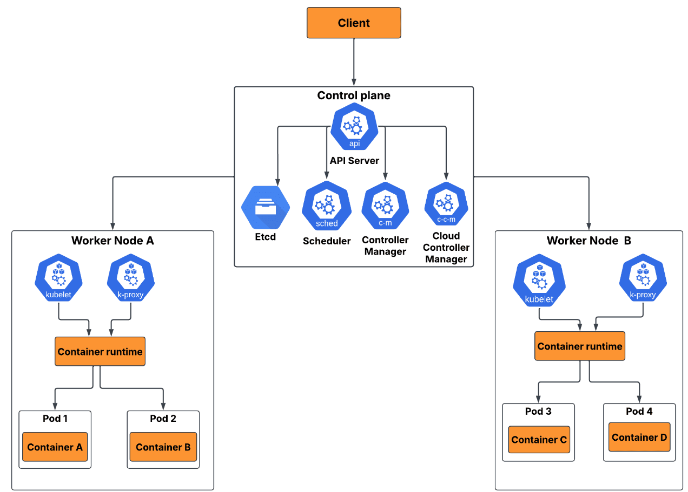

## K8S Architecture

Kubernetes (K8S) follows a master-worker distributed architecture. A Cluster is split into two primary layers.

The **Control-Plane** (the "Brain" that makes decisions) and **Worker-Nodes** (the "muscle" that runs your application workloads.)

  

