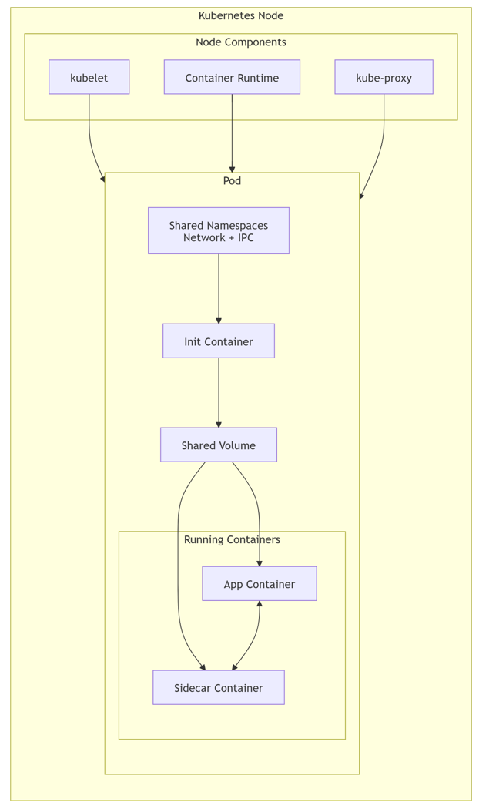
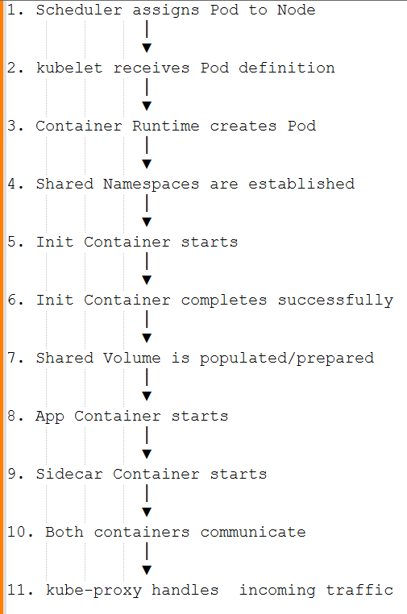
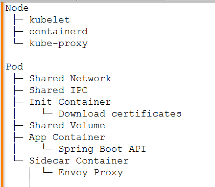
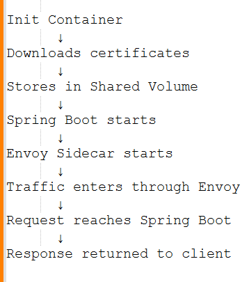

# Compute & Workloads:

Kubernetes abstracts physical or virtual infrastructure into a unified compute platform through declarative API primitives. Workloads are modeled as high-level controller abstractions that manage the lifecycle of low-level execution units.

* Node (Node Components - Kubelet, KubeProxy, Container Runtime)
*  Pod  (Container, Init Container, Side Car Container, Shared Volumes, Network Namespace (Network + IPC))
*  Pod life Cycle
*  Deployment
*  StatefulSet

## Physical & Runtime Foundations: Nodes & Containers

  

This diagram represents how a Pod runs inside a Kubernetes Node and how the different components work together. Let us walk through it from top to bottom, because that is also close to the actual pod startup flow.

### 1. Kubernetes Node:

The outermost box is a Kubernetes Node.

A Node is a worker machine (VM or physical server) where your application containers actually run.

**Responsibilities:**

* Runs containers
* Provides networking
* Provides storage access
* Reports health and status to the Kubernetes control plane

Think of the Node as an apartment building, and Pods are apartments inside it.

------------------------------------------------------------------------------------------------------------------------------

### 2. Node Components

These are the core Kubernetes services running on every node.

#### A. kubelet: The kubelet is the Node Agent.

What it does ?
* Registers the node with Kubernetes
* Watches for Pod specifications assigned to the node
* Ensures containers are running as defined
* Performs health checks
* Restarts failed containers

**Example:** Kubernetes API Server says:

Run a pod with:
- App Container
- Sidecar Container
The kubelet receives this instruction and tells the Container Runtime to create those containers.

#### B. Container Runtime: Actually runs containers.

When kubelet says: Start App Container, 

The Container Runtime:
1. Pulls image from registry
2. Creates container
3. Starts container process
4. Monitors container lifecycle

#### C. kube-proxy: Handles networking for Services.

What it does ?
1. Creates network routing rules
2. Enables Service-to-Pod communication
3. Load balances traffic across Pod replicas

------------------------------------------------------------------------------------------------------------------------------

### 3. Pod: The Pod is the smallest deployable unit in Kubernetes.

A Pod can contain:
1. One application container
2. Multiple containers
3. Init containers
4. Sidecars

All containers inside a Pod share certain resources.

------------------------------------------------------------------------------------------------------------------------------

### 4. Shared Namespaces: (Network + IPC)

This is what makes containers inside the Pod behave like they are on the same machine.

#### A. Network Namespace:

All containers share:
1. IP Address
2. Ports
3. Network Interfaces
4. Routing Table

**Example:** 

Pod IP - 10.244.1.5

App Container - localhost:8080

Sidecar Container can access it using: localhost:8080 - because both containers share the same network namespace.

#### B. IPC Namespace: IPC = Inter Process Communication

Allows containers to communicate using:
1. Shared memory
2. Message queues
3. Semaphores

Used less frequently than network sharing but still important for tightly coupled processes.

------------------------------------------------------------------------------------------------------------------------------

### 5. Init Container: The Init Container always runs first.

Perform setup activities before application starts.

**Examples:**
1. Download configuration
2. Validate dependencies
3. Create folders
4. Wait for database readiness
5. Generate certificates

**Important Rule:** Init Container MUST complete successfully before App and Sidecar containers start.

------------------------------------------------------------------------------------------------------------------------------

### 6. Shared Volume: A volume is storage shared among containers in the Pod.

**Examples:**
1. emptyDir
2. PersistentVolume
3. hostPath
4. ConfigMap volume

**Why it exists ?** To allow containers to exchange files.

**Example**
1. Init Container writes: /config/app.properties -> into the volume.
2. App Container reads: /config/app.properties   -> from the same volume.

------------------------------------------------------------------------------------------------------------------------------

### 7. Running Containers: 

After Init Container succeeds: App Container ↔ Sidecar Container starts together.

#### A. App Container: This is the primary business application.

**Examples:**
* Java Spring Boot
* Node.js API
* Python Flask Service
* .NET Application

**Responsibilities:**
1. Process requests
2. Connect to DB
3. Execute business logic

#### B. Sidecar Container:  Provides supporting functionality to the application.

**Common Uses:**
1. Logging - Collect logs from App Container. E.g., Fluentd, Fluent Bit
2. Monitoring - Collect metrics. E.g., Prometheus Exporter, Datadog Agent
3. Service Mesh - Handle network traffic. E.g., Istio Envoy, Linkerd Proxy
4. Security - Certificate management. E.g., Vault Agent

**Why App Container and Sidecar Communicate ?**

The bidirectional arrows indicate: App Container ↔ Sidecar Container

They can communicate because they share:
* Network namespace
* Storage volume

**Example:** Logging Sidecar
* App container writes to /app/logs/application.log
* Sidecar reads from /app/logs/application.log and forwards it to Splunk or ELK or CloudWatch.

### Complete Startup Flow: 

The actual sequence represented by the diagram is:

  

**Real-World Example:**

Imagine a Spring Boot application with Istio:

  

**Flow:**

  

This is exactly how most production Kubernetes workloads using sidecars (Istio, logging agents, monitoring agents, Vault agents, etc.) operate.

------------------------------------------------------------------------------------------------------------------------------

## Pod Life Cycle:

------------------------------------------------------------------------------------------------------------------------------

## Deployment:

------------------------------------------------------------------------------------------------------------------------------

## StatefulSet:
