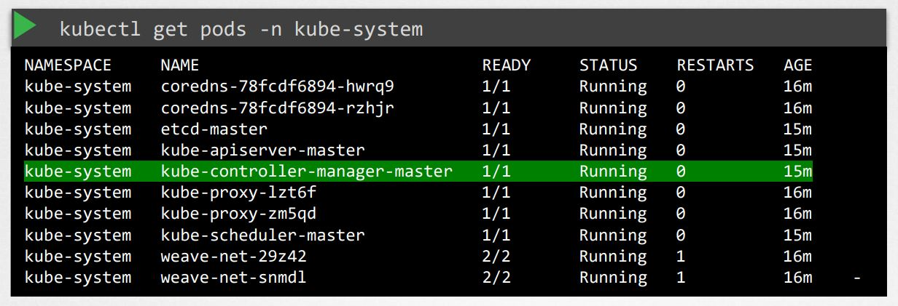

# K8S - Core Concepts:

Download Presentation Deck for this section
Please note that some slides are animated so content may not have exported correctly. Kindly use the slides as a reference for commands.

Resources for this lecture available at documents folder

* Kubernetes - CKA-0100 - Core Concepts
* Kubernetes-services-updated
* Core-Concepts
* Docker vs Contaionerd resources

## Core Concepts:

- Cluster Architceture
- API Primitives
- Services & Other Network Primitives

### Cluster Architceture

    ❑ Kubernetes Architecture

    ❑ ETCD in Kubernetes

    ❑ Kube-API Server

    ❑ Controller Managers

    ❑ Kube Scheduler

    ❑ Kubelet

    ❑ Kube Proxy

#### Kubernetes Architecture:

The Kubernetes cluster architecture is divided into two main segments:

<p align="center">
  
</p>

|Component Category |Key Components|Description
|-|-|-|
|Master Node|etcd, Kube Scheduler, Controllers, Kube API Server|Centralized control and management of the entire cluster.|
|Worker Node|Kubelet, Kube Proxy|Responsible for the lifecycle management of containers and ensuring network communication between services.|

##### Master Components:

###### 1. ETCD

**What is etcd?**

Etcd is an open-source, distributed key-value store that is the single source of truth for a Kubernetes cluster. It's designed to be reliable, consistent, and highly available, making it the perfect "brain" for a distributed system like Kubernetes. It stores all the configuration data, state data, and metadata for the entire cluster.

etcd is a distributed key-value store used by Kubernetes (K8s) to store all its cluster data. It's a critical component of Kubernetes' control plane, as it holds the state of the entire cluster, including information about nodes, pods, ConfigMaps, Secrets, ServiceAccounts, roles, bindings, and more.

**Why does Kubernetes use etcd?** or **What is etcd in Kubernetes?**

* **Purpose:** Acts as the single source of truth for the Kubernetes cluster.
* **Data stored:** Configuration data, cluster state, and metadata. (ex: Nodes, Pods, Replicas, Configmaps, Secrets, Resource Quotas, RBAC, Namespace definitions etc.)
* **Architecture:** Based on the Raft consensus algorithm to ensure high availability and consistency across nodes.
* **Watch Mechanism:** Etcd has a "watch" function that allows Kubernetes components to subscribe to changes in specific keys or directories. This is a core mechanism for 
  how Kubernetes works.

   For example, the kube-scheduler watches for new Pods to be scheduled, the kube-controller-manager watches for changes in objects, and the kubelet on each node watches for 
   Pods assigned to it. When a change occurs in etcd, the watching components are notified and can take action.

**How does etcd work with Kubernetes components?**

The Kubernetes components interact with etcd through the API Server (kube-apiserver). The API Server is the only component that should directly read from and write to etcd. This design provides a centralized and secure access point, ensuring data consistency and integrity.


**Here's a simplified flow of how it works:**

**1. User action:** A user or an automated process submits a request to the Kubernetes API Server, for example, to create a new Deployment.

**2. API Server interaction:** The API Server validates the request, serializes the object's definition (e.g., in Protobuf format), and stores it as a key-value pair in etcd.

**3. Etcd stores data:** Etcd replicates this data across its cluster members, ensuring consistency.

**4. Watchers are notified:** The API Server, through its watch mechanism, notifies other control plane components (like the scheduler and controllers) that a new Deployment has been created.

**5. Controllers take action:** The kube-controller-manager and kube-scheduler now see the desired state stored in etcd and take the necessary actions to make the actual state match the desired state. For instance, the scheduler assigns the new Pods to a node, and the kubelet on that node sees the assignment and creates the Pods.

**6. State updates:** As the state of the Pods and other resources changes (e.g., a Pod starts running), the kubelet and other components update the resource's status through the API Server, which then stores the updated information in etcd.

**Install ETCD:**

```
## Download Binaries: ##
wget -q --https-only \
"https://github.com/coreos/etcd/releases/download/v3.3.9/etcd-v3.3.9-linux-amd64.tar.gz"

## Extract Binary
tar xzvf etcd-v3.3.11-linux-amd64.tar.gz

## Run ETCD Service
./etcd
```
<p align="center">
  
</p>

```
## Operate ETCD ##
./etcd

./etcdctl set key1 value1

./etcdctl get key1
```

**Set Up Manual:**
```
## Download Binaries: ##
wget -q --https-only \
"https://github.com/coreos/etcd/releases/download/v3.3.9/etcd-v3.3.9-linux-amd64.tar.gz"

# Example etcd service configuration
ExecStart=/usr/local/bin/etcd \
  --name ${ETCD_NAME} \
  --cert-file=/etc/etcd/kubernetes.pem \
  --key-file=/etc/etcd/kubernetes-key.pem \
  --peer-cert-file=/etc/etcd/kubernetes.pem \
  --peer-key-file=/etc/etcd/kubernetes-key.pem \
  --trusted-ca-file=/etc/etcd/ca.pem \
  --peer-trusted-ca-file=/etc/etcd/ca.pem \
  --peer-client-cert-auth \
  --client-cert-auth \
  --initial-advertise-peer-urls https://${INTERNAL_IP}:2380 \
  --listen-peer-urls https://${INTERNAL_IP}:2380 \
  --listen-client-urls https://${INTERNAL_IP}:2379,https://127.0.0.1:2379 \
  --advertise-client-urls https://${INTERNAL_IP}:2379 \
  --initial-cluster-token etcd-cluster-0 \
  --initial-cluster controller-0=https://${CONTROLLER0_IP}:2380,controller-1=https://${CONTROLLER1_IP}:2380 \
  --initial-cluster-state new \
  --data-dir=/var/lib/etcd

```

<p align="center">
  
</p>

**Validate the ETCD component:**
```
kubectl get pods  -n kube-system
```
<p align="center">
  
</p>


###### 2. Kube API Server:

The Kubernetes API server (kube-apiserver) is the central management component of Kubernetes. It exposes the Kubernetes API, which is used by all internal components and external clients (like kubectl, controllers, and other services) to communicate with the cluster.

<p align="center">
  
</p>

* It is the entry point for all REST commands used to control the cluster.
* Acts as a front-end to the Kubernetes control plane.
* It is stateless—all cluster data is stored in etcd.

**API-Server Responsibilities:**

|Function|:Description|
|-|-|
|API Gateway|	Accepts REST API calls and processes them.|
|Authentication|	Verifies the identity of the client.|
|Authorization|	Checks whether the client is allowed to perform the requested action.|
|Admission Control|	Intercepts requests to validate or mutate objects before persistence.|
|Validates and Processes|	Validates object specs (e.g., pod specs) and sets default values.|
|Persistence to etcd|	Stores the validated data in etcd.|
|API Versioning|	Manages different API groups and versions (v1, apps/v1, etc.).|

**How it all works together (a simplified flow):**

1. A user runs kubectl create deployment my-app --image=nginx.
2. The kubectl client sends an API call (a POST request) to the kube-apiserver.
3. The API server authenticates and authorizes the user.
4. The request is passed through admission controllers for validation and potential mutation.
5. The API server serializes the Deployment object and stores its desired state in etcd.
6. The API server sends a successful response back to kubectl.
7. The kube-scheduler is watching the API server for new Pods. It sees that new Pods for the my-app Deployment need to be scheduled.
8. The scheduler decides which worker node is best suited for the Pods and updates the Pod's specification through the API server to include the assigned node's name.
9. The kubelet on that worker node is watching for Pods assigned to it. It sees the new Pod assigned to its node.
10. The kubelet creates the Pod on the node and starts the Nginx container.
11. The kubelet reports the Pod's status (e.g., Running) back to the API server, which updates the status in etcd.

**API-Server Configuration:**

```
## Download Binarie
wget https://storage.googleapis.com/kubernetes-release/release/v1.13.0/bin/linux/amd64/kube-apiserver

## kube-apiserver.service
ExecStart=/usr/local/bin/kube-apiserver \\
  --advertise-address=${INTERNAL_IP} \\
  --allow-privileged=true \\
  --apiserver-count=3 \\
  --authorization-mode=Node,RBAC \\
  --bind-address=0.0.0.0 \\
  --client-ca-file=/var/lib/kubernetes/ca.pem \\
  --enable-admission-plugins=Initializers,NamespaceLifecycle,NodeRestriction,LimitRanger,ServiceAccount,DefaultStorageClass,ResourceQuota \\
  --enable-swagger-ui=true \\
  --etcd-cafile=/var/lib/kubernetes/ca.pem \\
  --etcd-certfile=/var/lib/kubernetes/kubernetes.pem \\
  --etcd-keyfile=/var/lib/kubernetes/kubernetes-key.pem \\
  --etcd-servers=https://127.0.0.1:2379 \\
  --event-ttl=1h \\
  --experimental-encryption-provider-config=/var/lib/kubernetes/encryption-config.yaml \\
  --kubelet-certificate-authority=/var/lib/kubernetes/ca.pem \\
  --kubelet-client-certificate=/var/lib/kubernetes/kubernetes.pem \\
  --kubelet-client-key=/var/lib/kubernetes/kubernetes-key.pem \\
  --kubelet-https=true \\
  --runtime-config=api/all \\
  --service-account-key-file=/var/lib/kubernetes/service-account.pem \\
  --service-cluster-ip-range=10.32.0.0/24 \\
  --service-node-port-range=30000-32767 \\
  --v=2
```
**View Api-Server - kubeadm**

```
kubectl get pods  -n kube-system
```
<p align="center">
  
</p>

###### 3. Kube Controller Manager:

The Kubernetes Controller Manager (kube-controller-manager) is a key component of the Kubernetes control plane. It runs controller loops that monitor the state of the cluster and make changes to move it toward the desired state, as defined in the Kubernetes API (etcd).

**kube-apiserver** acts as the cluster's "**front door**" and "**record keeper**," the **kube-controller-manager** is the "**active brain**" that constantly works to drive the cluster towards its desired state.

**What is kube-controller-manager?**

It’s a daemon that runs a set of built-in controllers, each responsible for a specific resource or function in Kubernetes. All these controllers are compiled into a single binary and run as one process, which simplifies management and avoids duplication.

<p align="center">
  
</p>

**What Is a Controller** or **Control Loop** Concept ?

To understand the kube-controller-manager, it's vital to grasp the "control loop" concept in Kubernetes. Every controller operates on a continuous control loop:

  - **Observe:** It continuously watches the current state of a specific set of resources in the cluster by interacting with the kube-apiserver (which gets data from etcd).
  - **Compare:** It compares the observed current state with the desired state (also stored in etcd and accessed via the API server).
  - **Act:** If there's a discrepancy between the current and desired states, the controller takes action through the API server to reconcile them. This action might 
    involve creating new resources, deleting existing ones, updating configurations, or performing other operations.

This continuous reconciliation process is what makes Kubernetes self-healing and self-managing.

**Key Controllers Included:**

|Controller|Purpose|
|-|-|
|Node Controller|	Detects and responds when nodes go offline.|
|Replication Controller|	Maintains the correct number of pod replicas.|
|Endpoints Controller|	Populates Endpoints objects when Services are created.|
|Namespace Controller|	Manages lifecycle of namespaces (e.g., garbage collection).|
|Service Account Controller|	Creates default service accounts and tokens.|
|Job Controller|	Manages Job resources.|
|CronJob Controller|	Manages CronJobs (schedules jobs).|
|DaemonSet Controller|	Ensures a copy of a pod runs on all (or some) nodes.|
|Deployment Controller|	Handles Deployment rollouts and updates.|
|PVC Binder Controller|	Binds PersistentVolumeClaims to PersistentVolumes.|

**Installing Kuber-controller manager:**

<p align="center">
  
</p>

**View kube-controller-manager - kube-adm**

<p align="center">
  
</p>

###### 4. Kube Scheduler:

The Kubernetes Scheduler (kube-scheduler) is a key component of the Kubernetes control plane that is responsible for assigning newly created pods to nodes in your cluster.

  - It decides which node is the best fit for each unscheduled pod.
  - It does not start the pods—it only assigns them to nodes.
  - It watches the API server for pods with no node assigned, evaluates all available nodes, and updates the pod’s .spec.nodeName field.

**How It Works (Simplified Flow)**

  - A user creates a Pod (e.g., via Deployment, Job, etc.).
  - The API server stores the pod in etcd (without a node assigned).
  - The kube-scheduler notices this pod and:
    - Evaluates all available nodes.
    - Applies filters and scoring.
    - Chooses the best node.
  - It binds the pod to a node by updating the pod’s .spec.nodeName.
  - The kubelet on the chosen node picks up the pod and starts it.

**Scheduling Process (Two Phases):**

**1. Filtering Phase**

Eliminates nodes that cannot run the pod.
Examples of filter criteria:
  - Node has insufficient CPU/memory.
  - Node is unschedulable.
  - Node lacks required labels/tolerations.

**2. Scoring Phase**

Ranks the remaining nodes to pick the best fit.
Examples of scoring:
  - Spread pods evenly across nodes.
  - Prefer nodes with specific taints/labels.
  - Affinity/anti-affinity rules.

**Key Features:**

| Feature                  | Description                                                   |
| ------------------------ | ------------------------------------------------------------- |
| **Node Affinity**        | Prefer or require pods to run on certain nodes (via labels).  |
| **Taints & Tolerations** | Allow or block pods from certain nodes.                       |
| **Pod Affinity**         | Place pods near or far from others (same zone, node, etc.).   |
| **Resource Awareness**   | Considers CPU, memory, GPU, etc.                              |
| **Custom Schedulers**    | You can run your own custom scheduler for specific workloads. |


##### Worker Components:

###### 1. Kubelet:

The kubelet is an agent that runs on every worker node in a Kubernetes cluster. It is the primary node agent and is responsible for ensuring that containers are running in a Pod. It's the "worker bee" that takes instructions from the control plane and executes them on its assigned node.

**Key Roles and Responsibilities:**

**The kubelet's job can be summarized as:** maintaining a set of Pods and their containers on its node according to the specifications received from the API Server.

**Here are its core functions:**

  1. **Watching the API Server:** The kubelet continuously watches the kube-apiserver for new Pods that have been assigned to its specific node. It does this by monitoring 
     the spec.nodeName field in Pod definitions. If the node name matches its own, it knows it's responsible for that Pod.
  2. **Pod and Container Management:** Once a Pod is assigned to its node, the kubelet takes on the responsibility of:
       - **Creating the Pod:** It interacts with the container runtime (e.g., containerd, CRI-O, Docker) to pull the necessary container images from the registry.
       - **Starting the containers:** It starts the containers as defined in the Pod's manifest.
       - **Monitoring container health:** It performs liveness and readiness probes to check the health of the containers. If a container fails a liveness probe, the 
         kubelet restarts it.
       - **Managing volumes and networking:** It mounts the necessary volumes and sets up the networking for the Pod's containers.
       - **Stopping/Deleting containers:** It stops and cleans up containers when a Pod is deleted or evicted.
  3. **Reporting Node and Pod Status:** The kubelet regularly communicates the status of its node and the Pods running on it to the kube-apiserver. This includes:
       - **Pod Status:** Whether a Pod is Pending, Running, Succeeded, or Failed.
       - **Container Status:** The state of each container within a Pod.
       - **Node Status:** Information about the node's health (e.g., Ready, NotReady), resource capacity (CPU, memory, disk), and conditions (e.g., MemoryPressure, 
         DiskPressure).
  4. **Handling Liveness and Readiness Probes:** The kubelet executes the configured probes for each container:
       - **Liveness Probe:** Determines if a container is still "alive." If it fails, the kubelet restarts the container.
       - **Readiness Probe:** Determines if a container is "ready" to serve traffic. If it fails, the kubelet removes the Pod's IP address from the Service's Endpoints, 
         preventing traffic from being routed to it until it becomes ready again.
  5. **Garbage Collection:** It performs periodic cleanup of unused container images and dead containers to free up disk space.
  6. **Receiving instructions from static Pod manifests:** In addition to instructions from the API server, the kubelet can also be configured to monitor a local directory 
     for "static Pod" manifests. This is a common way to run the control plane components (like the kube-apiserver, etcd, kube-scheduler, and kube-controller-manager) as 
     Pods on the master nodes.

###### 2. Kube-proxy:

Kube-proxy is a network proxy that runs on each node in the cluster. Responsible for maintaining network rules on nodes to allow communication to your Kubernetes Services.
Implements service discovery and load balancing for TCP/UDP traffic across pods.

**Key Functions:**

| Function                     | Description                                                                |
| ---------------------------- | -------------------------------------------------------------------------- |
| **Service IP handling**      | Ensures traffic sent to a Service IP is routed to one of the backend pods. |
| **Load balancing**           | Balances traffic across healthy pods backing a Service.                    |
| **Network rules management** | Manages IP tables or IPVS rules for routing and forwarding packets.        |
| **Supports multiple modes**  | Uses **iptables**, **ipvs**, or userspace proxying (older method).         |

**How kube-proxy Works**

1. Watches the Kubernetes API server for Service and Endpoint changes.
2. Updates node network rules accordingly:
   - For iptables mode: Creates iptables rules that redirect Service IP traffic to pods.
   - For IPVS mode: Uses Linux IP Virtual Server (IPVS) for more efficient load balancing.
3. When a client connects to a Service IP, kube-proxy routes that traffic to one of the Service’s backend pods.

**Proxy Modes:**

| Mode          | Description                           | Pros                        | Cons                           |
| ------------- | ------------------------------------- | --------------------------- | ------------------------------ |
| **iptables**  | Uses Linux iptables rules             | Efficient, widely supported | Rules can get complex at scale |
| **IPVS**      | Uses Linux IP Virtual Server          | High performance, scalable  | Requires kernel modules        |
| **Userspace** | Proxy runs in user space (deprecated) | Simple but slow             | Less efficient, deprecated     |
