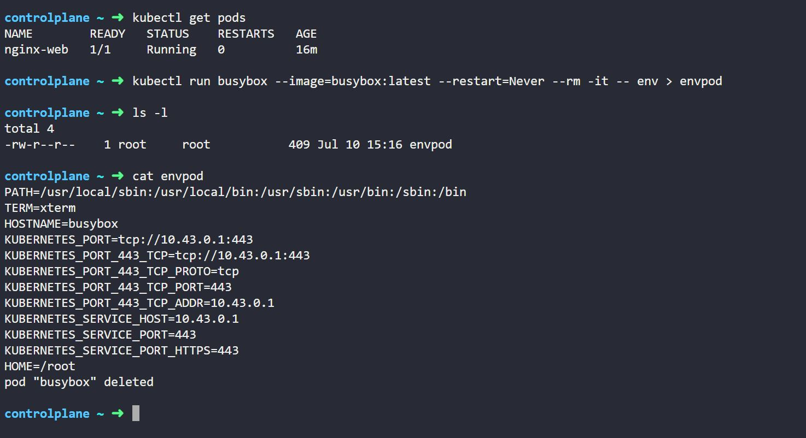
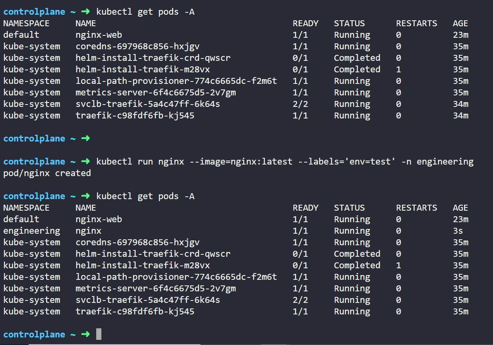
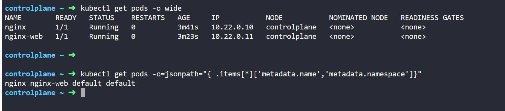
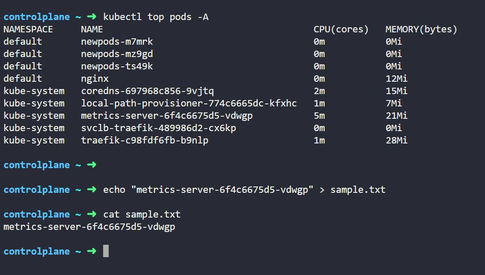

## CKA - Important Questions:

1. How to create a Pod with possible options:
```
kubectl run busybox --image=busybox:latest
kubectl run busybox --image=busybox:latest --port=80
kubectl run busybox --image=busybox:latest --env='env=dev'
kubectl run busybox --image=busybox:latest --restart=Never   (default -> **Always** other options: **Never**, **OnFailure**)
kubectl run busybox --image=busybox:latest --dry-run=client
kubectl run busybox --image=busybox:latest -o yaml > pod.yaml
kubectl run busybox --image=busybox:latest --rm --it -- sleep 6000
kubectl run busybox --image=busybox:latest --command sleep 6000
kubectl run busybox --image=busybox:latest --labels="account=finance"
kubectl run busybox --image=busybox:latest --labels='env=test' -n engineering
```
**Options:**

| Part                                | Explanation                                                                                               |
| ------------------------------------| --------------------------------------------------------------------------------------------------------- |
| `kubectl run busybox`               | Creates a pod named `busybox`.                                                                            |
| `--image=busybox:latest`            | Uses the BusyBox container image.                                                                         |
| `--port=80`                         | Declares container port 80 (for informational purposes — not exposed as a service unless you define one). |
| `--env="name=busybox"`              | Sets an environment variable `name=busybox` inside the container.                                         |
| `--labels="env=dev"`                | Applies the label `env=dev` to the pod.                                                                   |
| `--restart=Never`                   | Ensures it creates a plain Pod (not a Deployment).                                                        |
| `--rm`                              | Automatically removes the pod after it exits.                                                             |
| `--it`                              | Runs interactively with a TTY (good for debugging).                                                       |
| `-- sleep 60`                       | Runs the `sleep 60` command in the container.                                                             |


| Part                                | Explanation                                                                                               |
| ------------------------------------| --------------------------------------------------------------------------------------------------------- |
| `--requests='cpu=100m,memory=256Mi'`|	Resource requests                                                                                         |
| `--limits='cpu=200m,memory=512Mi'`	| Resource limits                                                                                           |

**Note:**
* requests/limits are Not valid options for pod creation, only for deployment, replicaset.
* we can use --overrides option

2. How to create a ingress with all possible options with imperative model:


1. Printing container env variables to a file "envpod":
   ```
   kubectl run busybox --image=busybox:latest --restart=Never --rm --it -- env > envpod
   ```
<p align="center">
  
</p> 

2. Create a nginx pod with label env=test in engineering namespace:
```
kubectl run nginx --image=nginx:latest --labels='env=test' -n engineering
```
<p align="center">
  
</p> 

3. Get list of all pods showing name and namespace with jsonpath expression

```
kubectl get pods -o=jsonpath="{.items[*]['metadata.name','metadata.namespace']}"
```
<p align="center">
  
</p>

4. From the pod lable **name=cpu-utilizer**, find pods running high cou workloads and write the name of the pod consumeing most CPU to the file **sample.txt**
```
kubectl top pods -A -l name=cpu-utilizer
```
<p align="center">
  
</p>
