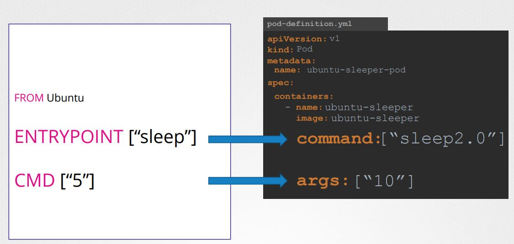

# K8S - Application LifeCycle Management:

Kubernetes provides tools and concepts to manage the entire lifecycle of a containerized application — from deployment to deletion, including scaling, upgrades, health checking, and rollback.
Here’s a breakdown of the full application lifecycle in Kubernetes:
 1. Deploy the K8S Application
    - Kubernetes Deployment Strategies
      - Recreate Strategy
      - Rolling Update Strategy
      - Blue-Green Deployment
      - Canary Deployment
      - A/B Testing
      - Argo Rollouts
 3. Update & Roll Out New Versions
 4. Rollback to Previous Version
 5. Scaling the Application
    - Manual Scaling
    - Auto Scaling
      - Horizontal Pod Autoscaler (HPA)
      - Vertical Pod Autoscaler (VPA)
      - Cluster Autoscaler
 6. Health Checking
 7. Configuration Management
    1. Commands and Arguments in a Kubernetes Pod Definition
     
   
## 1. Deploy the K8S Application:

Deploy your app using YAML manifests or tools like kubectl, Helm, or Kustomize.

Common resources:
- Deployment or StatefulSet: for managing pods
- Service: for networking access
- ConfigMap/Secret: for configuration
- PersistentVolumeClaim: for storage, if needed

```
kubectl apply -f deployment.yaml
```
 ### Kubernetes Deployment Strategies:

Kubernetes supports multiple deployment strategies to roll out changes to your applications. These strategies help manage downtime, risk, and user experience when upgrading apps in production.

 #### 1. Recreate Strategy:

`Stops old pods first, then starts new ones.`
```
strategy:
  type: Recreate
```
Use When:
- You can't run two versions simultaneously (e.g., DB migrations).
- Downtime is acceptable.

#### 2. Rolling Update Strategy (⚙️ Default):

Gradually replaces old pods with new ones, avoiding downtime.
```
strategy:
  type: RollingUpdate
  rollingUpdate:
    maxUnavailable: 1
    maxSurge: 1
```

| Field            | Description                          |
| ---------------- | ------------------------------------ |
| `maxUnavailable` | Max old pods that can be unavailable |
| `maxSurge`       | Max extra pods beyond desired count  |

Use When:
- You want zero downtime.
- Your app supports running multiple versions simultaneously.

#### 3. Blue-Green Deployment (manual via labels or services):

`Deploy new version in parallel, then switch traffic.`

Steps:
- Deploy v2 as a separate Deployment (e.g., app-blue, app-green)
- Test app-green independently
- Change the Service selector to point to app-green

Use When:
- You want easy rollback by switching back to old version.
- You can afford running double resources temporarily.

#### 4. Canary Deployment (manual or with progressive delivery tools):

`Gradually expose new version to a small subset of users.`

Steps:
- Deploy new version with fewer replicas (e.g., 1 out of 10)
- Monitor performance and errors
- Gradually increase traffic by adjusting replica count or weight

Use When:
- You want to test in production with minimal risk.
- You use tools like Istio, Linkerd, Flagger, or Argo Rollouts.

#### 5. A/B Testing (Traffic Splitting)

Route traffic to different versions based on headers, user IDs, etc.
- Requires a service mesh like Istio or NGINX Ingress Controller.
- Can be combined with Canary or Blue-Green.

#### 6. Argo Rollouts (Advanced Strategy Controller)

Argo Rollouts is a Kubernetes controller to support:
- Canary deployments with automated analysis
- Blue-green strategies with gates
- Progressive delivery

```
apiVersion: argoproj.io/v1alpha1
kind: Rollout
...
spec:
  strategy:
    canary:
      steps:
      - setWeight: 20
      - pause: {duration: 30s}
      - setWeight: 50
      - pause: {duration: 60s}
```

#### Summary Comparison Table:

| Strategy       | Downtime | Parallel Versions | Rollback Ease | Tools Required       |
|:-------------- | -------- | ----------------- | ------------- |:-------------------- |
| Recreate       | ❌ Yes    | ❌ No              | ❌ Manual      | None (built-in)      |
| Rolling Update | ✅ No     | ✅ Yes             | ✅ With `undo` | None (built-in)      |
| Blue-Green     | ✅ No     | ✅ Yes             | ✅ Easy        | Manual or Argo       |
| Canary         | ✅ No     | ✅ Yes             | ✅ Controlled  | Manual / Argo / Mesh |
| A/B Testing    | ✅ No     | ✅ Yes             | ✅ Controlled  | Istio / NGINX        |


## 2. Update & Roll Out New Versions:

Use rolling updates to deploy new versions without downtime.

```
kubectl set image deployment/my-app my-container=my-image:v2
```

- Kubernetes gradually replaces old pods with new ones.
- Controlled using strategy.rollingUpdate in the Deployment spec.

## 3. Rollback to Previous Version:

If something goes wrong, rollback to a previous working version.
```
kubectl rollout undo deployment my-app
```

Track rollout history:
```
kubectl rollout history deployment my-app
```

## 4. Scaling the Application:

Scaling in Kubernetes allows you to increase or decrease the number of pod replicas to handle changes in workload demand efficiently.

There are two main types of scaling:

### 1. Manual Scaling:

You manually change the number of pods.
```
kubectl scale deployment my-app --replicas=5
```
### 2. Auto Scaling:

Kubernetes can automatically adjust the number of pods based on CPU/memory usage, or custom metrics.

Types of Autoscaling:

| Type                                | Resource | Component                   |
| ----------------------------------- | -------- | --------------------------- |
| **HPA** (Horizontal Pod Autoscaler) | Pods     | CPU, memory, custom metrics |
| **VPA** (Vertical Pod Autoscaler)   | Pods     | Memory/CPU requests/limits  |
| **Cluster Autoscaler**              | Nodes    | Adds/removes cluster nodes  |

#### 1. Horizontal Pod Autoscaler (HPA):
- Scales pods in or out based on observed metrics (CPU, memory).

Command:
```
kubectl autoscale deployment my-app --cpu-percent=50 --min=2 --max=10
```

Template:
```
apiVersion: autoscaling/v2
kind: HorizontalPodAutoscaler
metadata:
  name: my-app-hpa
spec:
  scaleTargetRef:
    apiVersion: apps/v1
    kind: Deployment
    name: my-app
  minReplicas: 2
  maxReplicas: 10
  metrics:
  - type: Resource
    resource:
      name: cpu
      target:
        type: Utilization
        averageUtilization: 50
```
**Note:** `HPA requires resource requests/limits in your pod spec.`

#### 2. Vertical Pod Autoscaler (VPA)

- Adjusts resource requests/limits for a pod (not replica count).
- Used when pod needs more CPU/memory, but you want to keep just one replica.

`Not suitable for stateless web apps. Best for batch jobs or databases.`

#### 3. Cluster Autoscaler:

Automatically adds/removes nodes based on pod scheduling needs.
- Works with cloud platforms like GKE, EKS, AKS
- Adds nodes if pods are unschedulable
- Removes underutilized nodes

`Configured at cluster level, not per deployment.`

How to Check Scaling Status:
```
kubectl get hpa
kubectl describe hpa my-app
kubectl get deployment my-app
```

Summary:

| Type               | Scales    | Trigger                     | Common Use Case               |
| ------------------ | --------- | --------------------------- | ----------------------------- |
| Manual             | Pods      | Human action                | Quick control                 |
| HPA                | Pods      | CPU, memory, custom metrics | Web apps, APIs                |
| VPA                | Resources | Resource usage              | Batch jobs, stateful apps     |
| Cluster Autoscaler | Nodes     | Pod scheduling failures     | Cost-efficient resource usage |

## 5. Health Checking:

In Kubernetes, health checks ensure that containers are alive and ready to serve traffic. These checks help Kubernetes restart failing containers or keep them out of service until they're ready.

### Types of Probes (Health Checks)

| Probe Type          | Purpose                                        | Restart Container? | Affects Service Traffic? |
| ------------------- | ---------------------------------------------- | ------------------ | ------------------------ |
| **Liveness Probe**  | Checks if the container is **alive**           | ✅ Yes              | ❌ No                     |
| **Readiness Probe** | Checks if the container is **ready** to serve  | ❌ No               | ✅ Yes                    |
| **Startup Probe**   | Checks if app **has started (slow boot apps)** | ✅ Yes              | ✅ Yes (after success)    |

#### 1. Liveness Probe:

`Restarts the container if the check fails continuously.`

```
livenessProbe:
  httpGet:
    path: /healthz
    port: 8080
  initialDelaySeconds: 10
  periodSeconds: 5
```
#### 2. Readiness Probe:

`Controls whether the pod is included in the service endpoint list.`

```
readinessProbe:
  tcpSocket:
    port: 8080
  initialDelaySeconds: 5
  periodSeconds: 10
```

#### 3. Startup Probe

`Used for slow-starting applications. Disables other probes until success.`

```
startupProbe:
  httpGet:
    path: /startup
    port: 8080
  failureThreshold: 30
  periodSeconds: 5
```
Summary:

| Probe Type      | Checks...         | What it does                          |
| --------------- | ----------------- | ------------------------------------- |
| Liveness Probe  | Is the app alive? | Restarts pod if unhealthy             |
| Readiness Probe | Is app ready?     | Keeps pod out of Service until ready  |
| Startup Probe   | Has app started?  | Waits for boot-up before other checks |


## 6. Configuration Management:

### 1. Commands and Arguments in a Kubernetes Pod Definition:

In Kubernetes, you can control what your container executes on startup using the command and args fields in the pod or container spec. These override the container image's default ENTRYPOINT and CMD instructions (from Dockerfile).

Basic Definitions:

| Field     | Overrides Dockerfile | Equivalent Docker Concept |
| --------- | -------------------- | ------------------------- |
| `command` | `ENTRYPOINT`         | Command to run            |
| `args`    | `CMD`                | Arguments to the command  |

Syntax in Pod YAML:
```
spec:
  containers:
  - name: demo
    image: busybox
    command: ["sleep"]        # Overrides ENTRYPOINT
    args: ["3600"]            # Overrides CMD

```

This makes the container run: `sleep 3600'

Important Notes
- Both command and args take string arrays (list format).
- If you provide only args, it is passed to the image's default ENTRYPOINT.
- If you provide only command, it replaces the entrypoint and the image's CMD is ignored.

Example:

Dockerfile:
```
FROM Ubuntu
ENTRYPOINT ["sleep"]
CMD ["5"]
```
pod-definition.yaml:
```
apiVersion: v1
kind: Pod
metadata:
  name: ubuntu-sleeper-pod
spec:
  containers:
  - name: ubuntu-sleeper
    image: ubuntu-sleeper
    command: ["sleep"]
    args: ["5"]
```
Now apply the pod definition file:
```
kubectl apply -f pod-definition.yaml
```
To override the entrypoint from cli:
```
docker run --name ubuntu-sleeper --entrypoint "sleeper2.0" ubuntu-sleeper 10
```
In case of K8S:

<p align="center">
  
</p>

How to Check Actual Command in a Running Pod:

```
kubectl get pod <pod-name> -o jsonpath='{.spec.containers[*].command}'
kubectl get pod <pod-name> -o jsonpath='{.spec.containers[*].args}'
```

Summary:
| Field     | Description                          |
| --------- | ------------------------------------ |
| `command` | Overrides image's `ENTRYPOINT`       |
| `args`    | Overrides image's `CMD`              |
| Format    | List (`["/bin/sh", "-c"]`)           |
| Use case  | Customize container startup behavior |


### 2. Environment variables:

### 3. ConfigMaps:

### 4. Secrets:

### 5. Secret Store CSI Driver:

### 6. Encrypting Secret data at Rest:


