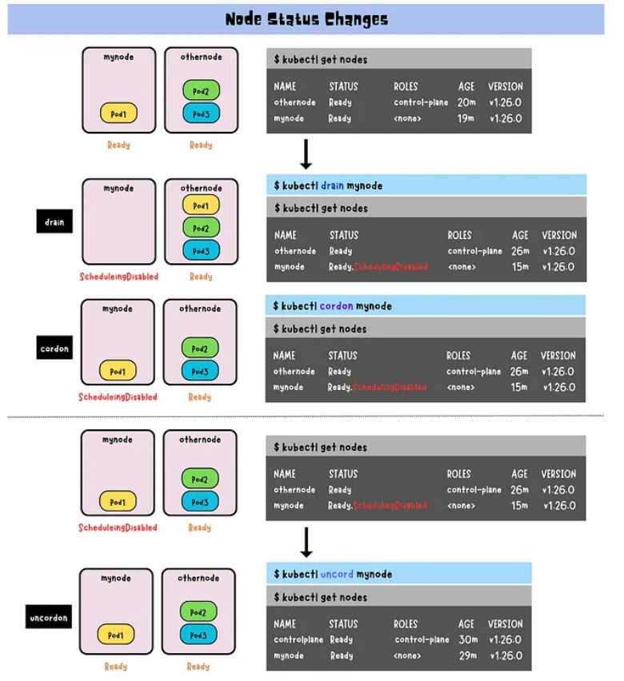
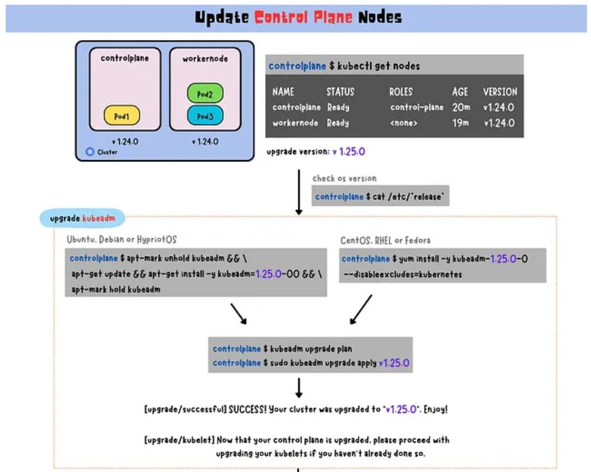
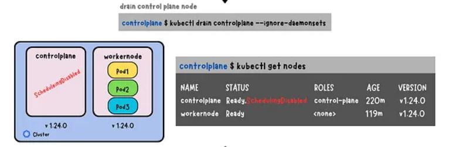
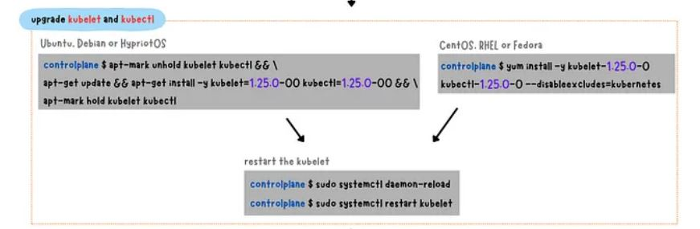
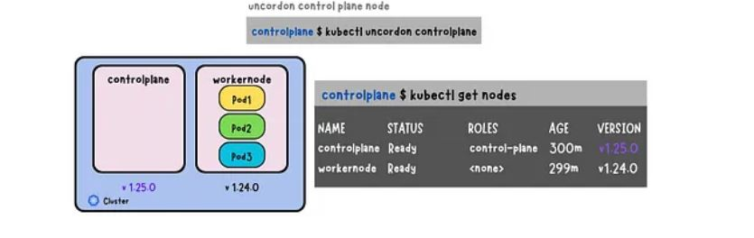
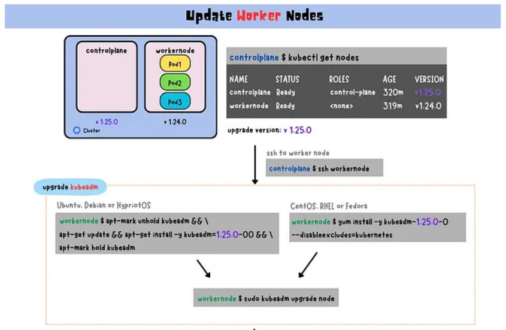
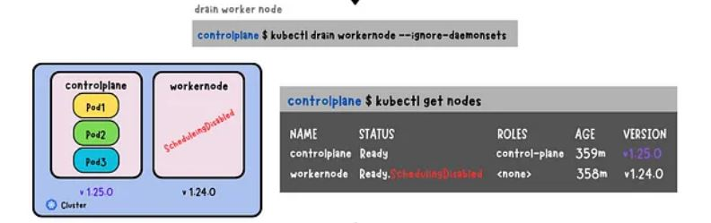
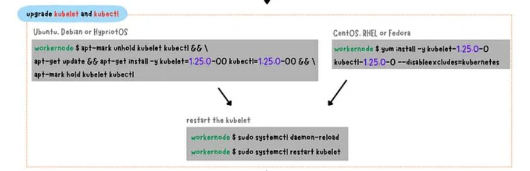
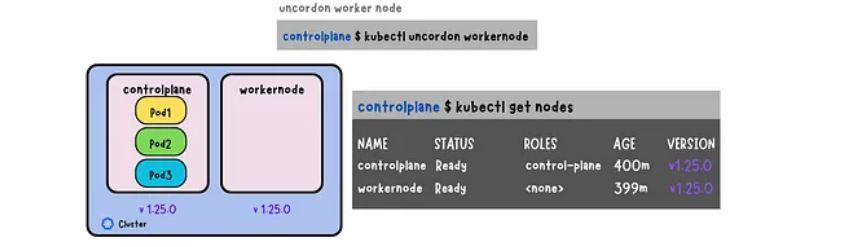

# K8S Cluster Maintenance:

## 1. Key Areas of Kubernetes Cluster Maintenance:

1. Node Maintenance
2. Kubernetes Version Upgrade ( Control plane & worker nodes)
3. Etcd Backup and Restore
4. Resource Cleanup
   - Delete unused:
     - Namespaces
     - Old ReplicaSets / Deployments
     - Orphaned PVs / PVCs
     - Unused ConfigMaps / Secrets
     - Completed or Failed Pods
5. Certificate Management
6. Monitoring & Logging
   - Monitor:
     - Node/Pod CPU, Memory, Disk
     - Network I/O
     - Pod restarts or crashes
     - API server performance
7. Security Maintenance
   - Rotate credentials regularly (kubeconfig, secrets, service account tokens).
   - Update images with security patches.
     - Network Policies
     - PodSecurity Standards / OPA Gatekeeper
     - Admission controllers
     - RBAC audit
8. Backup Strategy
    - Regularly back up:
      - etcd data
      - Kubernetes manifests
      - Application data (via Velero or restic, for example)
      - Secrets and ConfigMaps
9. Cluster Autoscaler & Node Group Management
   - Review:
     - Auto-scaling configurations
     - Spot/preemptible nodes health
     - Resource requests and limits
10. Audit and Logging
    - Enable and review:
      - Audit logs
      - Kube-apiserver logs
      - RBAC usage
      - Failed auth attempts
11. Test and Validate
    - Regularly run:
      - kubectl get componentstatuses
      - kubectl get nodes, kubectl top nodes/pods
      - Liveness/Readiness probes
      - Disaster recovery drills (backup restore tests)

## 2. Manage Nodes with drain, cordon, and uncordon Commands:

The drain, cordon, and uncordon commands are used in Kubernetes to manage nodes during maintenance or to temporarily take them offline. The drain command is used to gracefully remove a node from service by evicting all pods running on that node, scheduling them onto other available nodes and preventing new pods from being scheduled. The cordon command is used to temporarily disable scheduling new pods on a node, while allowing existing pods to continue running until they complete. The uncordon enables the scheduling of new pods onto a previously drained or cordoned node. These commands help ensure that workloads are safely migrated and prevent disruption to end-users during maintenance.

`drain, cordon, and uncordon are commands used in Kubernetes for managing nodes during maintenance or for temporarily taking them offline.`

**drain Command:**

```
$ kubectl drain <node_name>
$ kubectl drain <node_name> --ignore-daemonsets
```
`--ignore-daemonsets option: Tell Kubernetes to ignore the DaemonSet pods running on the node being drained and only evict the other pods running on that node.`

The drain command in Kubernetes is used to gracefully remove a node from service. Think of it as a way of temporarily taking a node offline for maintenance or when it is experiencing issues. When a node is drained, all the pods running on that node are evicted and scheduled onto other available nodes. At the same time, it also prevents new pods from being scheduled on that node. Therefore, it allows system administrators to take nodes offline for maintenance or repair, without causing any downtime or disruption to the end-users.

**cordon Command**

```
$ kubectl cordon <node_name>
```

The cordon command in Kubernetes is used to mark a node as unschedulable. This means that no new pods will be scheduled on that node, but the existing pods will continue to run on it. This can be useful in situations where maintenance is required, resources are scarce, troubleshooting is needed, or scaling down is necessary.

**uncordon Command**

```
$ kubectl uncordon <node_name>
```

The uncordon command is used to reverse the effects of cordon and mark a previously unschedulable node as schedulable again. Once uncordoned, the node can accept new pods for scheduling.

**Node Status Changes**

* **drain:**    Ready → Ready, SchedulingDisabled
* **cordon:**   Ready → Ready, SchedulingDisabled
* **uncordon:** Ready, SchedulingDisabled → Ready

<p align="center">
  
</p>


## 3. Kubernetes: Kubeadm Cluster Upgrade Workflow:

Upgrade Control Plane Nodes:

* upgrade kubeadm
* drain the control plane node
* upgrade kubelet and kubectl
* uncordon the control plane node

**Upgrade kubeadm:**

<p align="center">
  
</p>

**Drain the control plane node:**

<p align="center">
  
</p>

**Upgrade kubelet and kubectl:**

<p align="center">
  
</p>

**Uncordon the control plane node:**

<p align="center">
  
</p>

## Upgrade Worker Nodes

* upgrade kubeadm
* drain the worker node
* upgrade kubelet and kubectl
* uncordon the worker node

**Upgrade kubeadm:**

<p align="center">
  
</p>

**Drain the worker node:**

<p align="center">
  
</p>

**Upgrade kubelet and kubectl:**

<p align="center">
  
</p>

**Uncordon the worker node:**

<p align="center">
  
</p>


