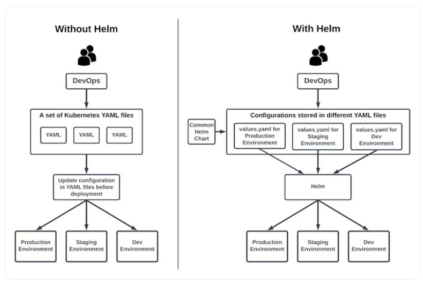
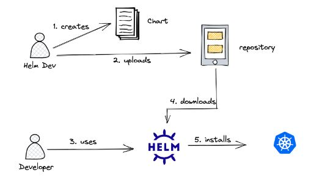
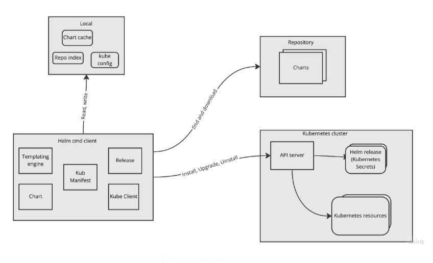

# K8S - Helm Basics

**What is Helm ?**

Helm is a package manager for Kubernetes that helps you define, install, and manage Kubernetes applications. It’s similar to tools like apt for Debian or yum for CentOS, but for Kubernetes.

Helm is a tool that simplifies the deployment, scaling, and management of applications on Kubernetes. Often described as a package manager for Kubernetes, it uses Helm charts—pre-configured templates that manage Kubernetes resources. 
This abstraction allows practitioners to deploy applications with a single Helm command, reducing the heavy lifting required in managing YAML files and kubectl commands.

<p align="center">
  
</p>

**How Does Helm Work?**

In the past, Helm had two main components: the Helm CLI (command line interface) and a server-side component known as Tiller. In version 3, Helm 3 removed Tiller for enhanced security and simplified operations, and now relies solely on the Helm CLI.

<p align="center">
  
</p>

* At its core, Helm is a command-line tool that interacts with the Kubernetes API server to manage application deployments. The foundation of Helm's functionality lies in its use of charts. Charts are collections of files that describe Kubernetes resources, and they can be created from scratch or obtained from public or private repositories.
* Helm supports various types of chart repositories, allowing you to share and distribute charts easily. These repositories can be local directories, remote HTTP/S servers, or cloud-based storage solutions. When you install a chart, Helm creates a release, which is an instance of that chart running in a Kubernetes cluster. Helm tracks the lifecycle of each release, enabling easy upgrades, rollbacks, and uninstallations.
* Prior to Helm 3, Tiller was a server-side component that interacted with the Kubernetes API server to manage releases. In Helm 3, Tiller was removed, and its functionality was integrated into the Helm client. One of Helm's key features is its ability to customize chart deployments by providing values during installation or upgrade. These values can override default configurations defined in the chart, enabling flexibility and adaptability.
* Additionally, Helm supports hooks, which are scripts that can be executed at specific points during a release's lifecycle, such as before or after installation, upgrade, or deletion. Hooks enable you to perform custom actions as part of the deployment process. Helm uses a templating engine called Go templates to render the Kubernetes manifests based on the chart's templates and the provided values, allowing for dynamic configuration and parameterization of resources.
* Finally, Helm tracks the revision history of each release, making it easy to upgrade to a newer version of a chart or roll back to a previous revision if necessary. This feature ensures a smooth and controlled application lifecycle management process.

<p align="center">
  
</p>

**Helm Chart Structure Example:**
```
my-chart/
├── Chart.yaml
├── values.yaml
├── templates/
│   ├── deployment.yaml
│   ├── service.yaml
│   └── _helpers.tpl
```

**Helm LifeCycle:**

```
 Package  -> Install -> Upgrade -> Rollback 
```

|Helm Command                      | Description |
|:---------------------------------|:------------|
|helm package ./my-chart| Package a chart:|
|helm install release-name ./my-chart| Deploy a Chart|
|helm upgrade release-name ./my-chart| Upgrade a Chart|
|helm rollback release-name 1 | Roolback to Previous version|
|helm uninstall rlease-name   | Uninstall the application|

**Note:** 

You can find impportant commands here: 

https://github.com/rammohanreddys/Kubestronaut/blob/feature-learning/2.CKA/Documents/Helm-cheat-sheet-by-PhoenixNAP.pdf
