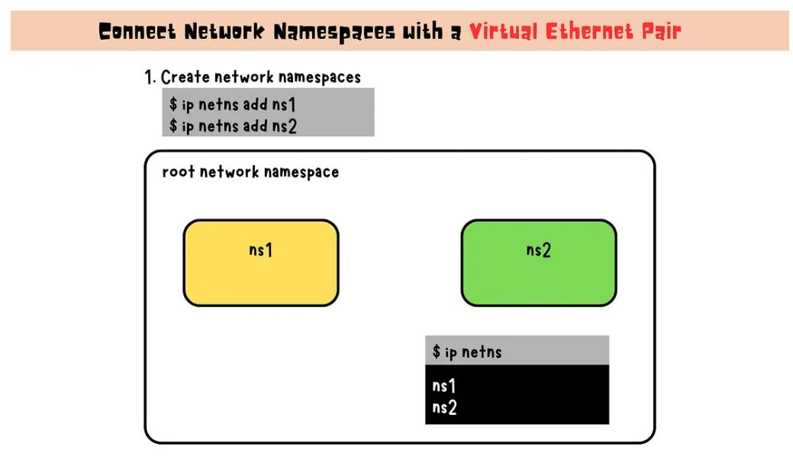

# K8S - Networking:

1. Linux Network Basics:
   * Switching, Routing and Gateway
   * DNS
   * Network Namespace
  
2. K8S Networking:
   * Container Network Interface (CNI)
   * Weave Net CNI Plugin
   * K8S DNS
   * Service Networking
   * Ingress
   * K8S API Gateway

# 1. Linux Network Basics:

## Linux Networking: Switching, Routing and Gateway:

### What is network switching ?

Switching is a process that occurs at the data link layer (Layer 2) of the OSI model. In the context of a local area network (LAN), a switch acts as a central point that connects multiple devices, such as computers, servers, and printers. It forwards network packets between devices within the same network (or broadcast domain) based on their MAC (Media Access Control) addresses. Switches are responsible for efficiently and accurately delivering packets to their intended destinations within the same LAN.

For example, let’s say you have a small office LAN with multiple computers connected to a switch. When computer A wants to send a network packet to computer C, it sends the packet to the switch. The switch examines the MAC address of the packet, determines which port computer C is connected to, and forwards the packet only to that port. This allows for efficient communication between devices within the same LAN without flooding unnecessary packets to all devices.


<p align="center">
  
</p>

### Important network commands:

1. Display the configuration of all network interfaces
```
$ ip link show
```
2. View the IP addresses of all network interfaces
```
$ ip addr show
```
3. Add an IP address to a network interface
```
$ ip addr add <ip_address>/<subnet_mask> dev <network_interface>
```
**<ip_address>**: The IP address that you want to assign to the network interface.

**<subnet_mask>**: The subnet mask that defines the network's address range. It is expressed in CIDR (Classless Inter-Domain Routing) notation, where the number after the forward slash ("/") specifies the number of bits in the subnet mask. For example, "/24" corresponds to a subnet mask of 255.255.255.0, which means that the network has 256 IP addresses available (2^8 - 2).

**<network_interface>**: The name of the network interface (e.g., eth0, eth1, enp0s1, etc.) to which you want to assign the IP address.

### Network Route:

Routing is the process of directing network traffic from one network to another. It involves the use of routers, which are network devices that make decisions about how to forward data packets across different networks based on their IP addresses. Routers operate at the network layer (Layer 3) of the OSI model and use routing tables to determine the most efficient path for packet delivery.

For example, consider a scenario where a computer A in a local area network (LAN) wants to send data to a computer F in another LAN.

* computer A: IP address 192.168.1.1
* computer F: IP address 192.168.2.3
* switch1 with IP address 192.168.1.0
* switch2 with IP address 192.168.2.0
* router IP address to reach switch1: 192.168.1.5
* router IP address to reach switch2: 192.168.2.5

<p align="center">
  
</p>
<p align="center">
  
</p>

4. Configure the gateway for computer A:
```
$ ip route add 192.168.2.0/24 via 192.168.1.5 dev eth0
```

`This command adds a route to the 192.168.2.0/24 network via the IP address of the router to reach Switch1 (192.168.1.5) through the “eth0” network interface of computer A.`

5. Configure the gateway for computer F:
```
$ ip route add 192.168.1.0/24 via 192.168.2.5 dev eth0
```

`This command adds a route to the 192.168.1.0/24 network via the IP address of the router to reach Switch2 (192.168.2.5) through the “eth0” network interface of computer F.`

Now, computer A can communicate with computer F, and the packet will be routed through the routers connected to Switch1 and Switch2, enabling inter-network communication between the two computers.

<p align="center">
  
</p>
<p align="center">
  
</p>

6. Add a routing entry to the IP routing table. It allows you to define how network traffic should be directed for a specific destination network.

```
$ ip route add <destination_network_ip>/<subnet_mask> via <gateway_ip> dev <network_interface>
```

* <**destination_network_ip**>: This specifies the IP address of the destination network you want to add to the routing table.
* <**subnet_mask**>: This specifies the subnet mask for the destination network, which determines the range of IP addresses that belong to the network.
* <**gateway_ip**>: This specifies the IP address of the gateway (router) that should be used to reach the destination network.
* <**network_interface**>: This specifies the network interface through which the traffic should be routed to reach the destination network.

7. View the IP routing table
```
$ route
```

### Gateway

A gateway is a network device, often a router, that connects a local network (e.g., LAN or VLAN) to other networks such as the Internet. 
It acts as a “doorway” for traffic to flow in and out of the local network, enabling communication between devices in different networks.

### Default Gateway

A default gateway, also known as a default route, is a special type of gateway that is used in computer networking to provide a default path for network traffic that is destined for a network outside of the local network. 

* In other words, it is the IP address of the router that is used as the exit point for network traffic that does not have a specific route in the routing table.
* When a device, such as a computer or a network switch, needs to send data to a destination network that is not part of its local network, it checks its routing table to determine the appropriate path.
* If there is no specific route for that destination network, the device forwards the traffic to the default gateway. The default gateway then forwards the traffic to the appropriate destination network based on its own routing table.


**Note:** The default gateway is typically displayed as the destination “0.0.0.0” or deafult with a netmask of “0.0.0.0”.

## Linux Networking: DNS

- In Linux networking, hostname resolution can be done through either the local /etc/hosts file, which maps hostnames to IP addresses, or by using DNS, a distributed system for resolving hostnames. 
- Configure DNS servers and search domains in /etc/resolv.conf. We can customize the lookup order in which /etc/hosts and DNS are used for hostname resolution in /etc/nsswitch.conf.
- Domain names are hierarchical, with top-level domains at the highest level. 
- A search domain automatically appends a domain name to an unqualified hostname to simplify access to local network resources. 
- Record types like A, AAAA, and CNAME provide different information for DNS lookups.

**/etc/hosts file**

The /etc/hosts file on Linux and Unix-based systems maps hostnames to IP addresses. It is used by the system’s resolver library to resolve hostnames without consulting a Domain Name System (DNS) server. Each line contains an IP address followed by one or more hostnames separated by whitespace. The IP address and hostname mapping is entered manually by a system administrator.

```
$ cat /etc/hosts
# This is a sample hosts file used by Linux operating systems

# IP address    hostname
127.0.0.1       localhost
127.0.1.1       myhostname.localdomain  myhostname
192.168.1.100   myserver.example.com  myserver
```

<p align="center">
  
</p>
<p align="center">
  
</p>

While editing the /etc/hosts file is a simple way to map hostnames to IP addresses on a local system, it becomes impractical in larger networks where multiple systems need to access different hosts. Maintaining a large number of entries in the /etc/hosts file for each system in the network can be a tedious and error-prone task.

`In these cases, a centralized DNS server is often used to provide a more scalable and flexible solution for hostname resolution.`

**Domain Name System (DNS)**

Domain Name System(DNS) enables the translation of human-readable domain names into IP addresses that machines can use to communicate with each other.

<p align="center">
  
</p>

When a Linux system needs to resolve a domain name, it sends a query to a DNS server. The DNS server then responds with the IP address associated with the domain name. If the DNS server does not have a record for the domain name, it can forward the query to other DNS servers until it finds the correct IP address.

**Configure DNS servers**:

<p align="center">
  
</p>

To configure the DNS server in Linux, we can modify the /etc/resolv.conf file. This is a plain text file that contains the IP address of the DNS server that the system should use for hostname resolution. To add a DNS server, we simply need to insert a “nameserver” line followed by the IP address of the DNS server.

For instance, to use the Google Public DNS server with IP address 8.8.8.8, we can add the following line to /etc/resolv.conf:

```
nameserver 8.8.8.8
```
If we want to use multiple DNS servers, we can add additional “nameserver” lines, one for each DNS server, like this:
```
nameserver 8.8.8.8
nameserver 8.8.4.4
```

Once we save the changes to the /etc/resolv.conf file, the system will use the specified DNS server(s) for hostname resolution.

**Hostname-to-IP Resolution Order:**

The order of hostname-to-IP mapping lookup can be specified in the /etc/nsswitch.conf file. This file specifies the order of the lookup methods used by the system’s Name Service Switch (NSS) library.

By default, the file includes a line that specifies “hosts: files dns”.

```
# /etc/nsswitch.conf
hosts:          files dns
```

<p align="center">
  
</p>

The system first looks in the /etc/hosts file for hostname-to-IP mappings, and if the hostname is not found in the file, it queries a DNS server to resolve the hostname.

However, the order can be changed by modifying the “hosts” line in /etc/nsswitch.conf to “hosts: dns files”.

```
# /etc/nsswitch.conf
hosts:          dns files
```

`The system first queries the DNS server for hostname-to-IP mappings, and if the hostname is not found in the DNS server, it looks in the /etc/hosts file.`

**Domain Name**:

A domain name is a hierarchical label used to identify a network domain on the Internet. It consists of multiple levels, separated by dots, with the rightmost label representing the top-level domain (TLD), and the other labels representing subdomains.

For example, mail.yahoo.com is a domain name where com is the top-level domain, yahoo is the second-level domain and also the subdomain of com, and mail the third-level domain and a subdomain of yahoo.

<p align="center">
  
</p>

* Top-level domains (TLDs): These are the highest level domains in the hierarchical Domain Name System.
* Second-level domains (SLDs): These are the domains directly below the TLDs.
* Subdomains: These are domains that are part of a larger domain and can be created by the owner of the domain.

## Network Namespaces:

Network namespaces enable the creation of multiple independent network stacks on a single Linux host, providing isolated environments for various applications, users, or services. This article illustrates how to connect network namespaces using virtual Ethernet pairs and a Linux bridge, as well as how to connect the host to these namespaces, thereby enabling network communication and isolation.

Network namespace is a Linux kernel feature that creates an isolated environment for networking, with its own network interfaces, routing table, firewall rules, and NAT rules. This enables network administrators to create virtual networks with increased security and flexibility. It is used in containerization technologies like Docker and Kubernetes to create isolated network environments for containerized applications.

### Connect Network Namespaces with a Virtual Ethernet Pair:

<p align="center">
  
</p>

1. Create network namespaces
```
$ ip netns add <namespace>
```
Example:
<p align="center">
  
</p>

```
$ ip netns add ns1
$ ip netns add ns2
```

2. Create a virtual Ethernet pair: Create a link between the two namespaces.
```
$ ip link add <veth_interface_1> type veth peer name <veth_interface_2>
```
Example:
<p align="center">
  
</p>

```
$ ip link add veth_ns1 type veth peer name veth_ns2
```
`This command creates a virtual Ethernet pair consisting of two interfaces, veth_ns1 and veth_ns2. These interfaces are connected to each other and behave like a virtual cable.`

3. Attach the veth pair to the corresponding network namespace
```
$ ip link set <veth_interface> netns <namespace>
```
Example:
<p align="center">
  
</p>

```
$ ip link set veth_ns1 netns ns1
$ ip link set veth_ns2 netns ns2
```

`This command moves the veth_ns1 interface into the ns1 namespace and the veth_ns2 interface into the ns2 namespace.`

4. Bring all interfaces up
```
$ ip netns exec <namespace> ip link set <veth_interface> up
```
Example:
<p align="center">
  
</p>

```
$ ip netns exec ns1 ip link set veth_ns1 up
$ ip netns exec ns2 ip link set veth_ns2 up
```
`This command enables the veth_ns1 interface in the ns1 namespace and the veth_ns2 interface in the ns2 namespace.`

5. Configure IP for namespaces
Execute a command inside that namespace, use the ip netns exec <namespace> <command> syntax.

```
$ ip netns exec <namespace> ip addr add <IP_address>/<subnet_mask> dev <veth_interface>
```
Example: 
<p align="center">
  
</p>

```
$ ip netns exec ns1 ip addr add 10.1.1.1/24 dev veth_ns1
$ ip netns exec ns2 ip addr add 10.1.1.2/24 dev veth_ns2
```
`This command assigns the IP address 10.1.1.1 to the veth_ns1 interface in the ns1 namespace and the IP address 10.1.1.2 to the veth_ns2 interface in the ns2 namespace.`

6. Verify the connectivity between namespaces
Ping the IP address of the other namespace.
```
$ ip netns exec <namespace_name> ping <IP_address>
```
Example:
<p align="center">
  
</p>

```
$ ip netns exec ns1 ping 10.1.1.2
$ ip netns exec ns2 ping 10.1.1.1
```

**Connect Network Namespaces Using a Linux Bridge**

A bridge is a software device that connects multiple network interfaces together, allowing them to communicate with each other.

<p align="center">
  
</p>

# 2. K8S Networking:

## Container Network Interface (CNI):

In Kubernetes, each Pod is assigned a unique IP address and can communicate with other Pods without requiring NAT. To provide networking to Pods, Kubernetes uses Container Network Interface (CNI), a library for configuring network interfaces in Linux containers. The kubelet is responsible for setting up the network for new Pods using the CNI plugin specified in the configuration file located in the /etc/cni/net.d/ directory on the node.

**Pod Networking**

Base on the Kubernetes network model, the key concepts for Pod networking in Kubernetes include:

* Each Pod has a unique cluster-wide IP address.
* Pods can communicate with all other Pods across nodes without NAT.
* Agents on a node can communicate with all Pods on that node.

**Container Network Interface(CNI)**

Container Network Interface(CNI) is a specification and library for configuring network interfaces in Linux containers. In Kubernetes, CNI is the standard way to provide networking to pods.

The main purpose of CNI is to allow different networking plugins to be used with container runtimes. This allows Kubernetes to be flexible and work with different networking solutions, such as Calico, Flannel, and Weave Net. CNI plugins are responsible for configuring network interfaces in pods, such as setting IP addresses, configuring routing, and managing network security policies.

**Kubelet and CNI: Managing Networks for Pods**:

<p align="center">
  
</p>
<p align="center">
  
</p>

In Kubernetes, the kubelet is responsible for setting up the network for a new Pod using the CNI plugin specified in the network configuration file located in the /etc/cni/net.d/ directory on the node. This configuration file contains necessary parameters to configure the network for the Pod.

The required CNI plugins referenced by the configuration should be installed in the /opt/cni/bin directory, which is the directory used by Kubernetes to store the CNI plugin binaries that manage network connectivity for Pods.

When a pod is created, the kubelet reads the network configuration file and identifies the CNI plugin specified in the file. The kubelet then loads the CNI plugin and invokes its “ADD” command with the Pod’s network configuration parameters. The CNI plugin takes over and creates a network namespace, configures the network interface, and sets up routing and firewall rules based on the configuration parameters provided by the kubelet. The kubelet saves the actual network configuration parameters used by the CNI plugin in a file in the Pod’s network namespace, located in the /var/run/netns/ directory on the node.

Finally, the kubelet notifies the container runtime, such as Docker, that the network is ready for the Pod to start.

## Weave Net CNI Plugin:


