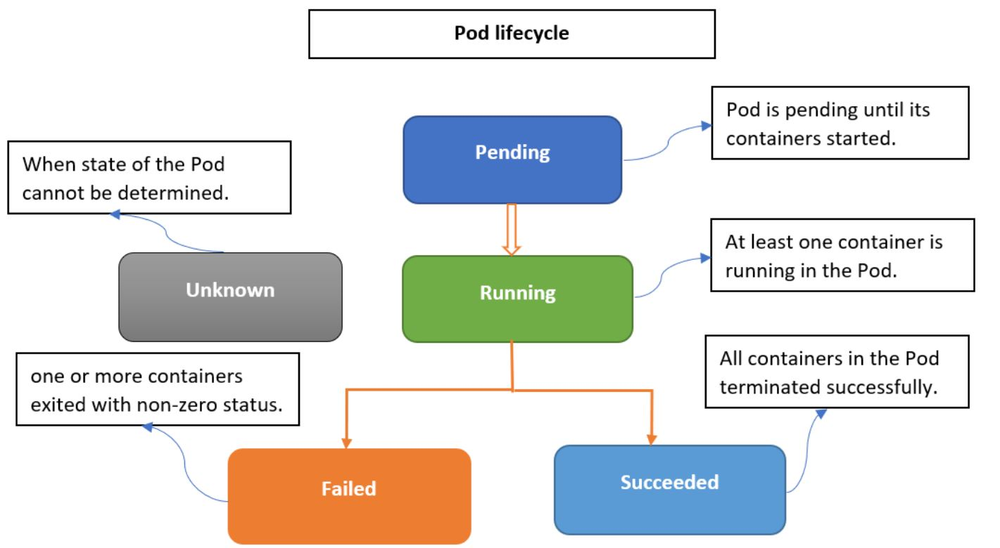

# K8S - Resources:

## Core Categories of Kubernetes Resources

| Category                | Description                                   | Examples                                                                           |
|:----------------------- |:--------------------------------------------- |:-----------------------------------------------------------------------------------|
| **Workload**            | Define how applications run                   | Pod, Replicaset, Deployment, Daemonset, StatefulSet, Job, CronJob                  |
| **Service & Discovery** | Expose and load balance applications          | Service, ClusterIP, NodePort, LoadBalancer, ExternalName, Ingress, Endpoint        |
| **Configuration**       | Store and inject configuration into workloads | ConfigMap, Secret                                                                  |
| **Storage**             | Persistent data handling                      | PVC, PV, StorageClass                                                              | 
| **Cluster Management**  | Define and control cluster behavior           | Namespace, Node, ResourceQuota                                                     | 
| **Access Control**      | Define permissions and security               | ServiceAccount, Role, Cluster-Role, RoleBinding, Cluster-RoleBinding, NetworkPolicy|


### Workload Resources:

#### 1. Pod:

A Pod is the smallest and simplest unit in the Kubernetes object model that you create or deploy. It represents a single instance of a running process in your cluster.

* A Pod represents a single instance of a running process in your cluster.
* It encapsulates one or more containers (typically one) that share:
  - Networking (same IP and port space)
  - Storage volumes
  - Lifecycle

**Types of Pod:**

* **Single Container Pod:** The "One-container-per-pod" is the most common use case and kubernetes manage po rather that container directly.
* **Multi Container Pod:** A Pod can group multiple containers with shared storage volumes and network resources. generally, we name it as Primary container and
  sidecar container.

**Pod Lifecycle:**

<p align="center">
  
</p>

**Pod phases:**

|Phase     | Description                                 |
|----------|---------------------------------------------|
|Pending   | Pod is accepted but not yet running.        |
|Running   | At least one container is running.          |
|Succeeded | All containers exited successfully.         |
|Failed    | One or more containers exited with an error.|
|Unknown   | Node is unreachable.                        |

**Container states:**

The way kubernetes maintain Pod pahses, it maintains state of each container in the pod.

Once the scheduler assigns a Pod to a Node, the kubelet starts creating containers for that pod using container runtime. There are 3 possible states for the containers.

|State     | Description                                                     |
|----------|-----------------------------------------------------------------|
|Waiting   |When the container still pulling image, applying secret data etc.|
|Running   |When the container executing without any issues                  |
|Terminated|When the container existed with non-zero status.                 |

**Pod Key Features:**

| Feature             | Description                                                          |
| ------------------- | -------------------------------------------------------------------- |
| **Containers**      | Multiple containers can run in one pod (shared network/storage).     |
| **IP Address**      | Each pod gets a unique IP within the cluster.                        |
| **Volumes**         | Shared storage across containers in a pod.                           |
| **Lifecycle Hooks** | Pre-start or pre-stop hooks can run scripts.                         |
| **Probes**          | Health checks like `liveness` and `readiness` to monitor app health. |


**Pod Template structure:**
```
apiVersion: v1
kind: Pod
metadata:
  name: my-nginx-pod
  labels:
    app: my-nginx-app
spec:
  containers:
  - name: nginx-container
    image: nginx:latest
    ports:
    - containerPort: 80
```

**Init Containers:**

Init Containers are special containers that run before the main app containers in a Pod. They are used to set up or prepare the environment for the main containers.

Init containers allow you to:
  - Run setup tasks before your app starts
  - Wait for a dependency (like a database or service) to be ready
  - Pull config/data from a source
  - Perform checks, like DB schema validation or secrets sync

**How Init Containers Work:**
  - They run one at a time (sequentially).
  - Each must complete successfully before the next one runs.
  - If any init container fails, Kubernetes retries it (backoff logic).
  - Only after all init containers finish, the main containers start.

**Example:**
```
apiVersion: v1
kind: Pod
metadata:
  name: init-demo
spec:
# This is the Init Container block
  initContainers:
  - name: init-myservice
    image: busybox
    command: ["sh", "-c", "echo Waiting for service... && sleep 10"]
# This is the main application container block
  containers:
  - name: main-app
    image: busybox
    command: ["sh", "-c", "echo Main app running... && sleep 3600"]
```

**Sidecar Containers:**

A sidecar container is a container that runs alongside the main application container in the same Pod. It is used to provide supporting functionality that complements or enhances the main container’s capabilities.
Sidecars share:
  - Network namespace (same IP/ports)
  - Volumes (shared filesystem)
  - Pod lifecycle

They help separate responsibilities while still tightly integrating with the main app.

**Common Use Cases:**

| Use Case                 | Description                                                               |
| ------------------------ | ------------------------------------------------------------------------- |
| **Logging agent**        | Collect logs from the main app and forward them (e.g., to Fluentd, Loki). |
| **Proxy container**      | Handle service mesh traffic (e.g., Istio Envoy sidecar).                  |
| **File sync**            | Download configs or data, e.g., from S3 or Git.                           |
| **Metrics exporter**     | Export Prometheus metrics from shared data.                               |
| **Auth token refresher** | Handle token renewals and mount them into a shared volume.                |

**Example:**
```
apiVersion: v1
kind: Pod
metadata:
  name: sidecar-demo
spec:
  containers:
  - name: main-app
    image: busybox
    command: ["sh", "-c", "echo Hello from main && sleep 3600"]
    volumeMounts:
    - name: shared-logs
      mountPath: /var/log/app
  - name: log-agent
    image: busybox
    command: ["sh", "-c", "tail -f /var/log/app/app.log"]
    volumeMounts:
    - name: shared-logs
      mountPath: /var/log/app
  volumes:
  - name: shared-logs
    emptyDir: {}
```

##### Kubectl commands for Pod:**

**Viewing Pods**

| Command                                                    | Description                            |
|:---------------------------------------------------------- |:-------------------------------------- |
| `kubectl get pods`                                         | List all pods in the current namespace |
| `kubectl get pods -n <namespace>`                          | List pods in a specific namespace      |
| `kubectl describe pod <pod-name>`                          | Show detailed information about a pod  |
| `kubectl get pod <pod-name> -o yaml`                       | Get full YAML of a pod                 |
| `kubectl get pod <pod-name> -o jsonpath='{.status.phase}'` | Extract specific pod field             |

**Creating & Managing Pods**


| Command                              | Description                                      |
|:------------------------------------ |:------------------------------------------------ |
| `kubectl run <name> --image=<image>` | Quickly create a pod from an image (for testing) |
| `kubectl apply -f pod.yaml`          | Create/update a pod from a YAML file             |
| `kubectl delete pod <pod-name>`      | Delete a specific pod                            |
| `kubectl delete -f pod.yaml`         | Delete a pod defined in YAML                     |

**Interacting with Pod Containers**

| Command                                                        | Description                             |
|:-------------------------------------------------------------- |:--------------------------------------- |
| `kubectl exec -it <pod-name> -- /bin/sh`                       | Open shell in a pod (BusyBox or Alpine) |
| `kubectl exec -it <pod-name> -c <container-name> -- /bin/bash` | Exec into a specific container          |
| `kubectl logs <pod-name>`                                      | View logs of a pod (single container)   |
| `kubectl logs <pod-name> -c <container-name>`                  | View logs from a specific container     |
| `kubectl port-forward <pod-name> 8080:80`                      | Forward local port to a port on the pod |
| `kubectl cp <file> <pod-name>:/path`                           | Copy file into a pod                    |
| `kubectl cp <pod-name>:/path <file>`                           | Copy file from a pod                    |

**Pod Health & Status**

| Command                                                       | Description                                           |
|:--------------------------------------------------------------|:----------------------------------------------------- |
| `kubectl get pods --watch`                                    | Continuously watch pod status                         |
| `kubectl get pod <name> -o wide`                              | Show pod IP, node info, etc.                          |
| `kubectl top pod`                                             | Show CPU and memory usage (requires `metrics-server`) |
| `kubectl wait --for=condition=Ready pod/<name> --timeout=60s` | Wait for a pod to be ready                            |

**Example: Create Pod YAML**

```
kubectl run nginx --image=nginx --dry-run=client -o yaml > nginx-pod.yaml
```
This creates a basic Pod YAML you can edit before applying with:
```
kubectl apply -f nginx-pod.yaml
```


