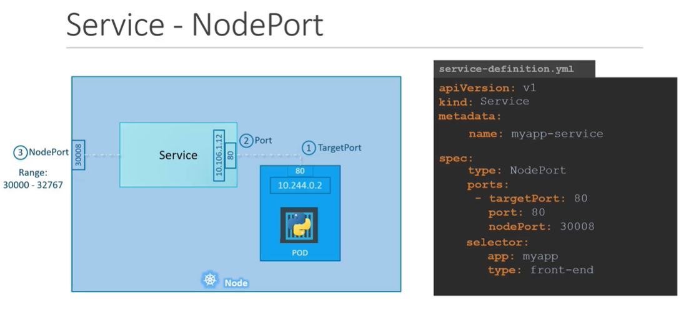
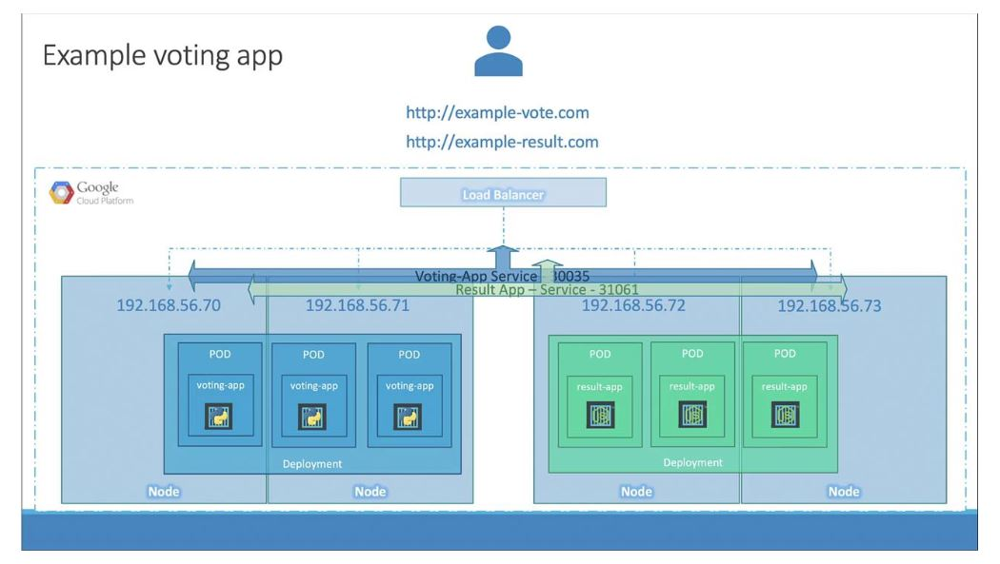

# K8S - Resources:

**Course Context:**

- Core Categories of Kubernetes Resources
  - Workload Resources
    - Pod
    - ReplicaSet
    - Deployment
    - Service
      - ClusterIP
      - NodePort
      - LoadBalancer
      - ExternalName
      - HeadLess
    - Namespace
## Core Categories of Kubernetes Resources

| Category                | Description                                   | Examples                                                                           |
|:----------------------- |:--------------------------------------------- |:-----------------------------------------------------------------------------------|
| **Workload**            | Define how applications run                   | Pod, Replicaset, Deployment, Daemonset, StatefulSet, Job, CronJob                  |
| **Service & Discovery** | Expose and load balance applications          | Service, ClusterIP, NodePort, LoadBalancer, ExternalName, Ingress, Endpoint        |
| **Configuration**       | Store and inject configuration into workloads | ConfigMap, Secret                                                                  |
| **Storage**             | Persistent data handling                      | PVC, PV, StorageClass                                                              | 
| **Cluster Management**  | Define and control cluster behavior           | Namespace, Node, ResourceQuota                                                     | 
| **Access Control**      | Define permissions and security               | ServiceAccount, Role, Cluster-Role, RoleBinding, Cluster-RoleBinding, NetworkPolicy|


### Workload Resources:

#### 1. Pod:

A Pod is the smallest and simplest unit in the Kubernetes object model that you create or deploy. It represents a single instance of a running process in your cluster.

* A Pod represents a single instance of a running process in your cluster.
* It encapsulates one or more containers (typically one) that share:
  - Networking (same IP and port space)
  - Storage volumes
  - Lifecycle

##### Types of Pod:

* **Single Container Pod:** The "One-container-per-pod" is the most common use case and kubernetes manage po rather that container directly.
* **Multi Container Pod:** A Pod can group multiple containers with shared storage volumes and network resources. generally, we name it as Primary container and
  sidecar container.

**Pod Lifecycle:**

<p align="center">
  
</p>

**Pod phases:**

|Phase     | Description                                 |
|----------|---------------------------------------------|
|Pending   | Pod is accepted but not yet running.        |
|Running   | At least one container is running.          |
|Succeeded | All containers exited successfully.         |
|Failed    | One or more containers exited with an error.|
|Unknown   | Node is unreachable.                        |

**Container states:**

The way kubernetes maintain Pod pahses, it maintains state of each container in the pod.

Once the scheduler assigns a Pod to a Node, the kubelet starts creating containers for that pod using container runtime. There are 3 possible states for the containers.

|State     | Description                                                     |
|----------|-----------------------------------------------------------------|
|Waiting   |When the container still pulling image, applying secret data etc.|
|Running   |When the container executing without any issues                  |
|Terminated|When the container existed with non-zero status.                 |

**Pod Key Features:**

| Feature             | Description                                                          |
| ------------------- | -------------------------------------------------------------------- |
| **Containers**      | Multiple containers can run in one pod (shared network/storage).     |
| **IP Address**      | Each pod gets a unique IP within the cluster.                        |
| **Volumes**         | Shared storage across containers in a pod.                           |
| **Lifecycle Hooks** | Pre-start or pre-stop hooks can run scripts.                         |
| **Probes**          | Health checks like `liveness` and `readiness` to monitor app health. |


**Pod Template structure:**
```
apiVersion: v1
kind: Pod
metadata:
  name: my-nginx-pod
  labels:
    app: my-nginx-app
spec:
  containers:
  - name: nginx-container
    image: nginx:latest
    ports:
    - containerPort: 80
```

##### Init Containers:

Init Containers are special containers that run before the main app containers in a Pod. They are used to set up or prepare the environment for the main containers.

Init containers allow you to:
  - Run setup tasks before your app starts
  - Wait for a dependency (like a database or service) to be ready
  - Pull config/data from a source
  - Perform checks, like DB schema validation or secrets sync

**How Init Containers Work:**
  - They run one at a time (sequentially).
  - Each must complete successfully before the next one runs.
  - If any init container fails, Kubernetes retries it (backoff logic).
  - Only after all init containers finish, the main containers start.

**Example:**
```
apiVersion: v1
kind: Pod
metadata:
  name: init-demo
spec:
# This is the Init Container block
  initContainers:
  - name: init-myservice
    image: busybox
    command: ["sh", "-c", "echo Waiting for service... && sleep 10"]
# This is the main application container block
  containers:
  - name: main-app
    image: busybox
    command: ["sh", "-c", "echo Main app running... && sleep 3600"]
```

##### Sidecar Containers:

A sidecar container is a container that runs alongside the main application container in the same Pod. It is used to provide supporting functionality that complements or enhances the main container’s capabilities.
Sidecars share:
  - Network namespace (same IP/ports)
  - Volumes (shared filesystem)
  - Pod lifecycle

They help separate responsibilities while still tightly integrating with the main app.

**Common Use Cases:**

| Use Case                 | Description                                                               |
| ------------------------ | ------------------------------------------------------------------------- |
| **Logging agent**        | Collect logs from the main app and forward them (e.g., to Fluentd, Loki). |
| **Proxy container**      | Handle service mesh traffic (e.g., Istio Envoy sidecar).                  |
| **File sync**            | Download configs or data, e.g., from S3 or Git.                           |
| **Metrics exporter**     | Export Prometheus metrics from shared data.                               |
| **Auth token refresher** | Handle token renewals and mount them into a shared volume.                |

**Example:**
```
apiVersion: v1
kind: Pod
metadata:
  name: sidecar-demo
spec:
  containers:
  - name: main-app
    image: busybox
    command: ["sh", "-c", "echo Hello from main && sleep 3600"]
    volumeMounts:
    - name: shared-logs
      mountPath: /var/log/app
  - name: log-agent
    image: busybox
    command: ["sh", "-c", "tail -f /var/log/app/app.log"]
    volumeMounts:
    - name: shared-logs
      mountPath: /var/log/app
  volumes:
  - name: shared-logs
    emptyDir: {}
```

##### Kubectl commands for Pod:**

**Viewing Pods**

| Command                                                    | Description                            |
|:---------------------------------------------------------- |:-------------------------------------- |
| `kubectl get pods`                                         | List all pods in the current namespace |
| `kubectl get pods -n <namespace>`                          | List pods in a specific namespace      |
| `kubectl describe pod <pod-name>`                          | Show detailed information about a pod  |
| `kubectl get pod <pod-name> -o yaml`                       | Get full YAML of a pod                 |
| `kubectl get pod <pod-name> -o jsonpath='{.status.phase}'` | Extract specific pod field             |

**Creating & Managing Pods**


| Command                              | Description                                      |
|:------------------------------------ |:------------------------------------------------ |
| `kubectl run <name> --image=<image>` | Quickly create a pod from an image (for testing) |
| `kubectl apply -f pod.yaml`          | Create/update a pod from a YAML file             |
| `kubectl delete pod <pod-name>`      | Delete a specific pod                            |
| `kubectl delete -f pod.yaml`         | Delete a pod defined in YAML                     |

**Interacting with Pod Containers**

| Command                                                        | Description                             |
|:-------------------------------------------------------------- |:--------------------------------------- |
| `kubectl exec -it <pod-name> -- /bin/sh`                       | Open shell in a pod (BusyBox or Alpine) |
| `kubectl exec -it <pod-name> -c <container-name> -- /bin/bash` | Exec into a specific container          |
| `kubectl logs <pod-name>`                                      | View logs of a pod (single container)   |
| `kubectl logs <pod-name> -c <container-name>`                  | View logs from a specific container     |
| `kubectl port-forward <pod-name> 8080:80`                      | Forward local port to a port on the pod |
| `kubectl cp <file> <pod-name>:/path`                           | Copy file into a pod                    |
| `kubectl cp <pod-name>:/path <file>`                           | Copy file from a pod                    |

**Pod Health & Status**

| Command                                                       | Description                                           |
|:--------------------------------------------------------------|:----------------------------------------------------- |
| `kubectl get pods --watch`                                    | Continuously watch pod status                         |
| `kubectl get pod <name> -o wide`                              | Show pod IP, node info, etc.                          |
| `kubectl top pod`                                             | Show CPU and memory usage (requires `metrics-server`) |
| `kubectl wait --for=condition=Ready pod/<name> --timeout=60s` | Wait for a pod to be ready                            |

**Example: Create Pod YAML**

```
kubectl run nginx --image=nginx --dry-run=client -o yaml > nginx-pod.yaml
```
This creates a basic Pod YAML you can edit before applying with:
```
kubectl apply -f nginx-pod.yaml
```
#### 2. ReplicaSet:

A ReplicaSet in Kubernetes ensures that a specified number of pod replicas are running at any given time. It is mostly used indirectly through Deployments, but understanding ReplicaSets is important for grasping how Kubernetes maintains pod availability.

**Key Concepts:**

  - **Ensures Availability:** Maintains the desired number of identical pod replicas.
  - **Self-Healing:** If a pod fails or is deleted, the ReplicaSet creates a new one.
  - **Selector-Based:** Uses labels to identify which pods it should manage.

**Basic Example of a ReplicaSet:**

```
apiVersion: apps/v1
kind: ReplicaSet
metadata:
  name: my-replicaset
spec:
  replicas: 3
  selector:
    matchLabels:
      app: myapp
  template:
    metadata:
      labels:
        app: myapp
    spec:
      containers:
      - name: my-container
        image: nginx
```

**How It Works:**

  1. **Creation:** When the ReplicaSet is applied, it checks how many matching pods exist.
  2. **Matching:** If fewer than desired, it creates more pods using the template.
  3. **Monitoring:** Continuously watches for pod health and count.
  4. **Reconciliation Loop:** Maintains the desired state (number of pods) even after failures.

**Kubectl commands for Replicaset:**

```
`kubectl get rs`                                           ## List all ReplicaSets
`kubectl get rs -n <namespace>`                            ## List all ReplicaSets in the specific namespace
`kubectl describe rs <replicaset-name>`                    ## Describe a ReplicaSet (view detailed info)
`kubectl get rs <replicaset-name> -o yaml`                 ## Get YAML/JSON definition of a ReplicaSet
`kubectl get rs <replicaset-name> -o json`                 ## Get YAML/JSON definition of a ReplicaSet
`kubectl apply -f replicaset.yaml`                         ## Create a ReplicaSet from YAML file
`kubectl edit rs <replicaset-name>`                        ## Update the number of replicas
`kubectl scale rs <replicaset-name> --replicas=5`          ## Update the number of replicas
`kubectl delete rs <replicaset-name>`                      ## Delete a ReplicaSet
`kubectl get pods --selector=<label-key>=<label-value>`    ## Check which pods are managed by a ReplicaSet
```

**Replicaset vs Replication Controller:**

**What They Are ?**

| Feature         | **ReplicaSet**                                                      | **ReplicationController**                             |
| --------------- | ------------------------------------------------------------------- | ----------------------------------------------------- |
| Purpose         | Ensures a specified number of identical pod replicas are running    | Same purpose — ensures desired number of pod replicas |
| Controller Type | **Newer generation** (recommended)                                  | **Legacy controller** (deprecated)                    |
| Pod Matching    | Uses **label selectors with set-based and equality-based matching** | Uses only **equality-based label selectors**          |

**Detailed Comparison**:

| Category                | ReplicaSet                   | ReplicationController         |
| ----------------------- | ---------------------------- | ----------------------------- |
| Introduced In           | Kubernetes 1.2+              | Kubernetes 1.0                |
| Label Selector Support  | ✅ Set-based + equality-based | ❌ Only equality-based         |
| YAML Field              | `kind: ReplicaSet`           | `kind: ReplicationController` |
| Rolling Updates Support | ❌ (used via Deployment)      | ❌                             |
| Typically Used With     | Managed by **Deployment**    | Standalone                    |
| Recommended for Use?    | ✅ Yes                        | ❌ No (legacy)                 |


#### 3. Deployment:

A Deployment in Kubernetes is a higher-level abstraction that manages ReplicaSets and Pods. It enables declarative updates for your application (e.g., rolling updates, rollbacks, scaling).

**Key Responsibilities and Features of a Deployment:**

  - Manages ReplicaSets:
  - Declarative Updates:
  - Rolling Updates (Default Strategy):
  - Automated Rollbacks:
  - Self-Healing:
  - Scaling:
  - Version Control and History:

**Example of a Kubernetes Deployment YAML:**

```
apiVersion: apps/v1
kind: Deployment
metadata:
  name: my-deployment
  labels:
    app: nginx-app
spec:
  replicas: 3
  selector:
    matchLabels:
      app: nginx-app
  template:
    metadata:
      labels:
        app: nginx-app
    spec:
      containers:
      - name: nginx
        image: nginx:1.25
        ports:
        - containerPort: 80
```

**Common kubectl Commands for Deployment:**

| Purpose                      | Command                                                   |
| ---------------------------- | --------------------------------------------------------- |
| List all deployments         | `kubectl get deployments`                                 |
| View details of a deployment | `kubectl describe deployment <name>`                      |
| View YAML of a deployment    | `kubectl get deployment <name> -o yaml`                   |
| Create deployment from YAML  | `kubectl apply -f deployment.yaml`                        |
| Update replicas              | `kubectl scale deployment <name> --replicas=5`            |
| Trigger a rolling update     | `kubectl set image deployment <name> <container>=<image>` |
| Pause/resume rollout         | `kubectl rollout pause/resume deployment <name>`          |
| Check rollout status         | `kubectl rollout status deployment <name>`                |
| Rollback to previous version | `kubectl rollout undo deployment <name>`                  |
| Delete a deployment          | `kubectl delete deployment <name>`                        |

**Additional Commands:**

| Purpose                      | Command                                                   |
|:---------------------------- |:--------------------------------------------------------- |
|Create an NGINX Pod           | `kubectl run nginx --image=nginx`                         |
|Generate POD Manifest YAML file (-o yaml). Don't create it(--dry-run)| `kubectl run nginx --image=nginx --dry-run=client -o yaml`|
|Create a deployment                                                  | `kubectl create deployment --image=nginx nginx`            |
|Generate Deployment YAML file (-o yaml). Don't create it(--dry-run)  | `kubectl create deployment --image=nginx nginx --dry-run=client -o yaml`|
|Generate Deployment YAML file (-o yaml). Don’t create it(–dry-run) and save it to a file.| `kubectl create deployment --image=nginx nginx --dry-run=client -o yaml > nginx-deployment.yaml`|
|Make necessary changes to the file (for example, adding more replicas) and then create the deployment.| `kubectl create -f nginx-deployment.yaml`|
|create a deployment with 4 replicas| `kubectl create deployment --image=nginx nginx --replicas=4 --dry-run=client -o yaml > nginx-deployment.yaml`|

**Deployment vs ReplicaSet:**

| Capability           | **Deployment** | **ReplicaSet** |
| -------------------- | -------------- | -------------- |
| Manages Pods         | ✅ (via RS)     | ✅              |
| Rolling Updates      | ✅              | ❌              |
| Rollbacks            | ✅              | ❌              |
| Ideal for Production | ✅              | ❌              |
| Abstracts ReplicaSet | ✅              | ❌              |

#### 4. Service:

A Service in Kubernetes is an abstraction that exposes a set of pods as a network service. Since pods are ephemeral (can be replaced or rescheduled), a Service provides a stable IP and DNS name to access them reliably.

**Why Use a Service?**

 - Pods have dynamic IPs.
 - Services enable stable communication between components (e.g., frontend → backend).
 - They support load balancing across a group of pods.

**Types of Services:**

| Service Type          | Description                                                                 |
| --------------------- | --------------------------------------------------------------------------- |
| `ClusterIP` (default) | Exposes the service on an internal IP (accessible only within the cluster). |
| `NodePort`            | Exposes the service on a static port on each node's IP.                     |
| `LoadBalancer`        | Provisions an external IP via cloud provider's load balancer.               |
| `ExternalName`        | Maps the service to an external DNS name (e.g., external database).         |

##### 1. ClusterIP:

ClusterIP is the default type of Kubernetes Service that exposes an application internally within the cluster. It creates a virtual IP address (VIP) that other services and pods in the cluster can use to communicate with the service.

**How it Works?**

 - You define a Service with type: ClusterIP.
 - Kubernetes assigns it a virtual IP (ClusterIP).
 - DNS like my-clusterip-service.default.svc.cluster.local is created.
 - Any pod within the cluster can use that IP or DNS to reach the pods matching the selector


**Example: ClusterIP Service**

```
apiVersion: v1
kind: Service
metadata:
  name: my-service
spec:
  selector:
    app: myapp
  ports:
    - protocol: TCP
      port: 80        # service port
      targetPort: 8080  # pod port
  type: ClusterIP
```

##### 2. NodePort:

NodePort is a type of Kubernetes Service that exposes your application outside the cluster by opening a static port on each Node’s IP address.

You can then access the service using:
```
http://<NodeIP>:<NodePort>
```

<p align="center">
  
</p>

**Example:**
```
apiVersion: v1
kind: Service
metadata:
  name: my-nodeport-service
spec:
  type: NodePort
  selector:
    app: myapp
  ports:
    - port: 80          # Service port (internal)
      targetPort: 8080  # Pod/container port
      nodePort: 30036   # Exposed on all node IPs (optional, auto-assigned if omitted)
```

##### 3. Load Balancer:

A LoadBalancer service type exposes your application to the external world via a cloud provider's external load balancer (like GCP Load Balancer, AWS ELB, Azure LB).

`It is the simplest way to expose a service to the internet on cloud-managed clusters.`

<p align="center">
  
</p>

**Example:**

```
apiVersion: v1
kind: Service
metadata:
  name: my-loadbalancer-service
spec:
  type: LoadBalancer
  selector:
    app: myapp
  ports:
    - protocol: TCP
      port: 80          # Port exposed externally
      targetPort: 8080  # Port in the pod
```

##### 4. ExternalName:

An ExternalName service is a special type of Kubernetes service that maps a service name to an external DNS name, rather than routing to a set of pods.

It does not create a ClusterIP or proxy — instead, DNS queries to the service name return the external hostname.

**Key Use Cases:**

- Accessing external databases (e.g., RDS, MongoDB Atlas).
- Connecting to third-party APIs from within your cluster.
- Referencing external services using Kubernetes-native service names.

**Example:**
```
apiVersion: v1
kind: Service
metadata:
  name: my-external-service
spec:
  type: ExternalName
  externalName: external.example.com
```

##### 5. Headless:

A Headless Service is a special kind of Kubernetes Service without a Cluster IP. It is used when you want direct access to individual pods, instead of load balancing through a virtual IP.

`It enables DNS-based service discovery where each pod gets its own DNS record`

**Why Use Headless Services?**

For stateful applications that need stable network identity, like:
- Kafka
- Cassandra
- Elasticsearch
For service discovery where clients need to connect directly to individual pods

**Example:**

```
apiVersion: v1
kind: Service
metadata:
  name: my-headless-service
spec:
  clusterIP: None
  selector:
    app: myapp
  ports:
    - port: 80
      targetPort: 8080
```


**Service types differences:**

|Characteristic|ClusterIP|NodePort|LoadBalancer|ExternalName|Headless|
|:--------------|:---------|:--------|:------------|:------------|:--------|
|Accessibility|Internal|External|External|Internal|Internal|
|Use case|Expose Pods to other Pods in your cluster|Expose Pods on a specific Port of each Node|Expose Pods using a cloud load balancer resource|Configure a cluster DNS CNAME record that resolves to a specified address|Interface with external service discovery systems|
|Suitable for|Internal communications between workloads|Accessing workloads outside the cluster, for one-off or development use|Serving publicly accessible web apps and APIs in production|Decoupling your workloads from direct dependencies on external service URLs|Advanced custom networking that avoids automatic Kubernetes proxying|
|Client connection type|Stable cluster-internal IP address or DNS name|Port on Node IP address|IP address of external load balancer|Stable cluster-internal IP address or DNS name|Stable-cluster internal IP address or DNS name that also enables DNS resolution of the Pod IPs behind the Service|
|External dependencies|None|Free port on each Node|A Load Balancer component (typically billable by your cloud provider)|None|None|

**Useful Commands:**

| Action           | Command                                        |
| ---------------- | ---------------------------------------------- |
| List services    | `kubectl get svc`                              |
|                  | 'kubectl get services`                         |
| Describe service | `kubectl describe svc my-clusterip-service`    |
|List services in a specific namespace:| `kubectl get svc -n <namespace>`|
|Edit a Service| `kubectl edit svc <service-name>`|
|Create a Service from YAML| `kubectl apply -f service.yaml`|
|Delete a Service | `kubectl delete svc <service-name>`|
|Expose a Deployment as a Service| `kubectl expose deployment <deployment-name> --type=ClusterIP --port=80 --target-port=8080`|
|Expose a Pod as a Service|`kubectl expose pod <pod-name> --port=80 --target-port=8080 --name=my-service`|
|Port Forward to a Service| `kubectl port-forward svc/<service-name> <local-port>:<service-port>`|
|                         | `kubectl port-forward svc/my-service 8080:80`|
|Get Service Endpoints (Pod IPs)| `kubectl get endpoints <service-name>`|
| Get service IP   | `kubectl get svc my-clusterip-service`         |
| Get DNS name     | `<service-name>.<namespace>.svc.cluster.local` |
|Check DNS Resolution from a Pod| `kubectl exec -it <pod-name> -- nslookup <service-name>`|
||`kubectl exec -it nginx-pod -- nslookup my-service`|
|Get External IP for LoadBalancer Services|`kubectl get svc <service-name> -o wide`|

#### 5. Namespace:

A Namespace in Kubernetes is a logical partition within a cluster that allows you to group and isolate resources (pods, services, deployments, etc.). It helps in multi-team, multi-project, or environment setups (e.g., dev/test/prod).

**Key Benefits:**

| Feature                      | Purpose                                |
| ---------------------------- | -------------------------------------- |
| **Isolation**                | Isolates resources between teams/apps  |
| **Access Control (RBAC)**    | Fine-grained user access per namespace |
| **Resource Quotas & Limits** | Restrict CPU/memory per namespace      |
| **Organizational Clarity**   | Logical grouping of resources          |

**Default Namespaces:**

| Namespace         | Purpose                                                         |
| ----------------- | --------------------------------------------------------------- |
| `default`         | Default for resources with no namespace                         |
| `kube-system`     | Kubernetes core components (e.g., kube-dns, controller-manager) |
| `kube-public`     | Public, readable by all (used during cluster bootstrapping)     |
| `kube-node-lease` | Used for node heartbeats                                        |

**Common kubectl Commands for Namespaces:**

| Action                                              | Command                                                        |
| --------------------------------------------------- | -------------------------------------------------------------- |
| List all namespaces                                 | `kubectl get namespaces` or `kubectl get ns`                   |
| Create a namespace                                  | `kubectl create namespace <name>`                              |
| Delete a namespace                                  | `kubectl delete namespace <name>`                              |
| View resources in a namespace                       | `kubectl get all -n <namespace>`                               |
| Switch context to a namespace (with kubectl config) | `kubectl config set-context --current --namespace=<namespace>` |

**Example:**
```
apiVersion: v1
kind: Pod
metadata:
  name: nginx
  namespace: dev
spec:
  containers:
  - name: nginx
    image: nginx
```


