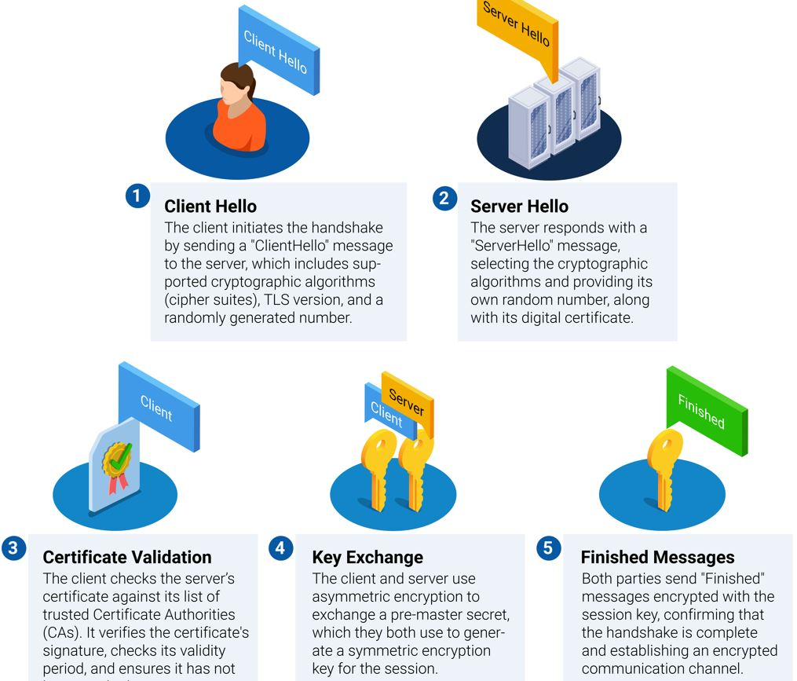
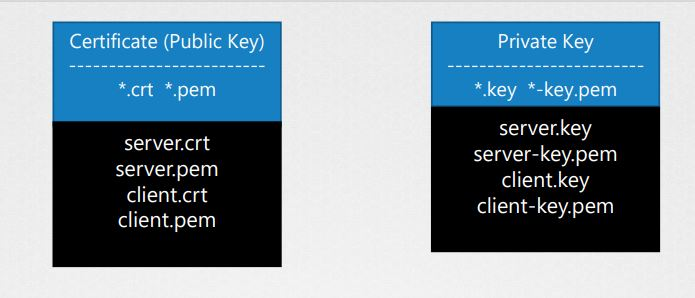
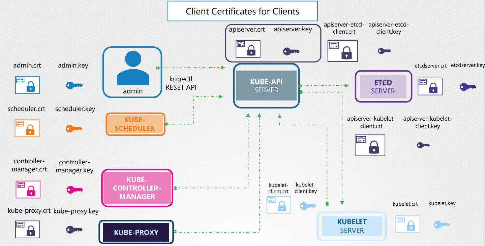
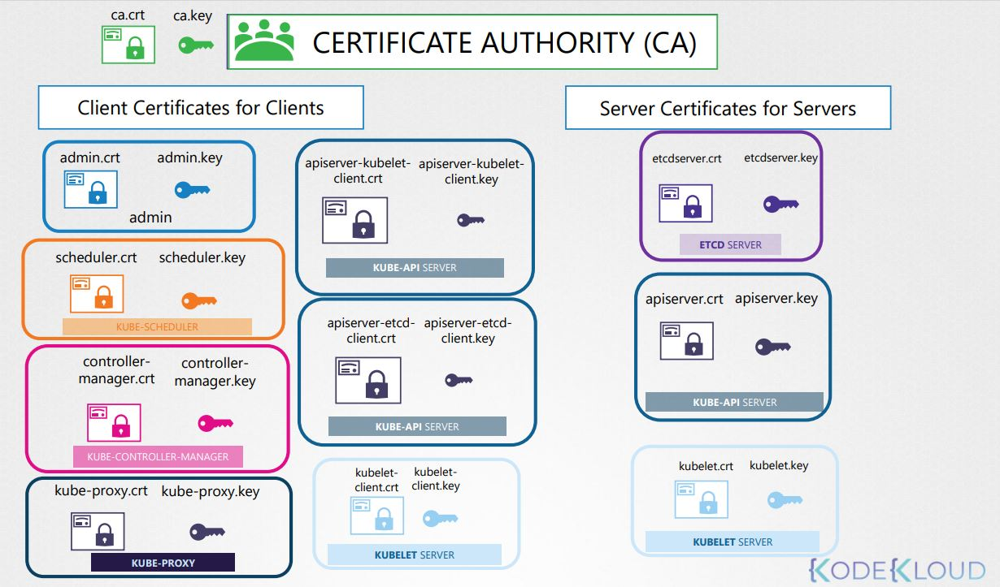
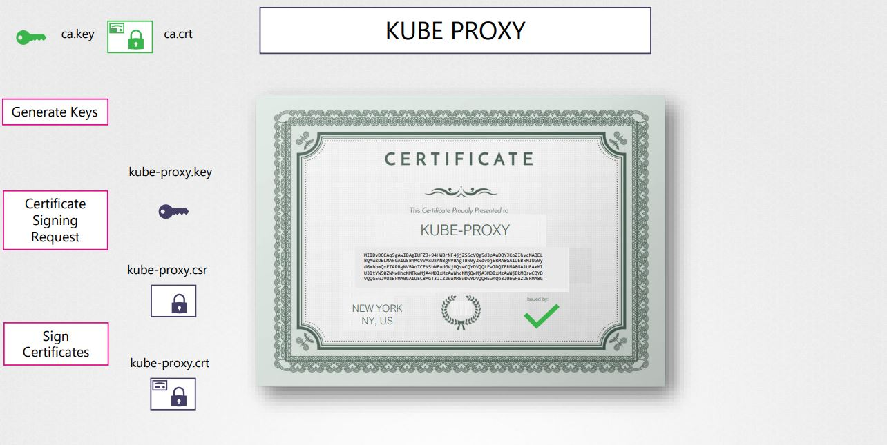
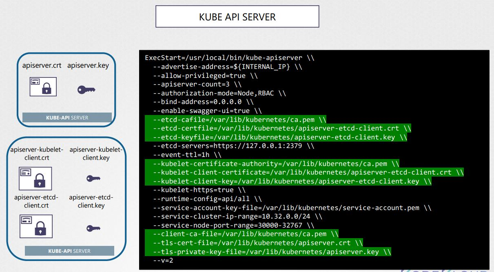
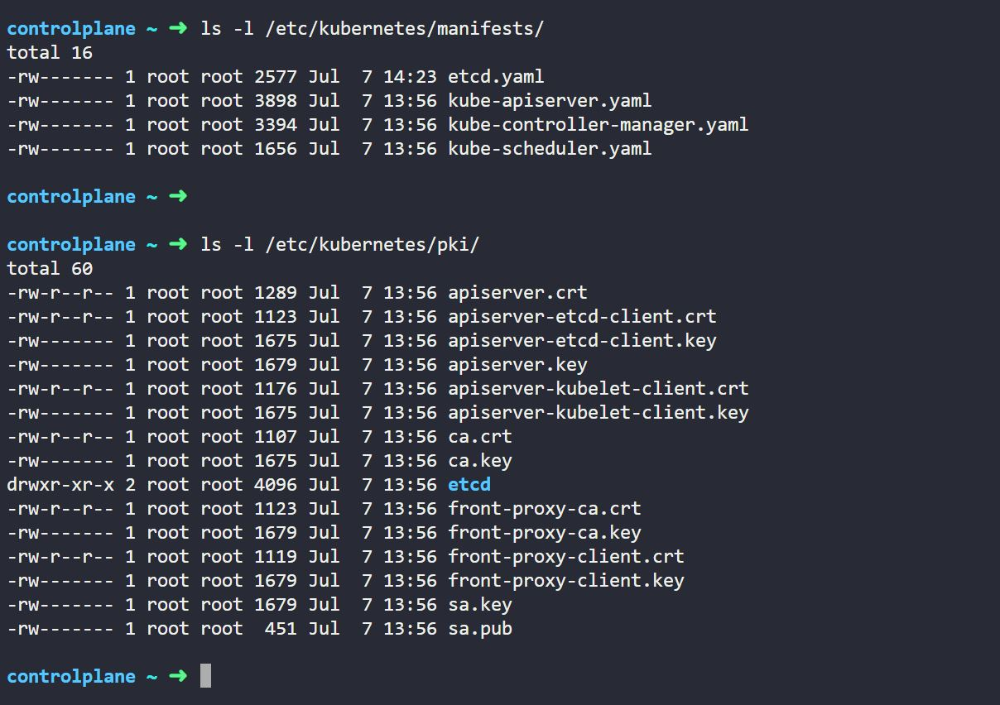
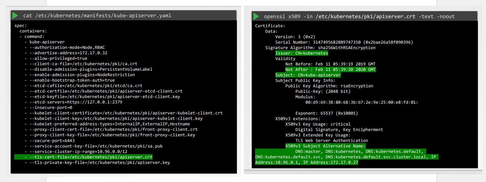
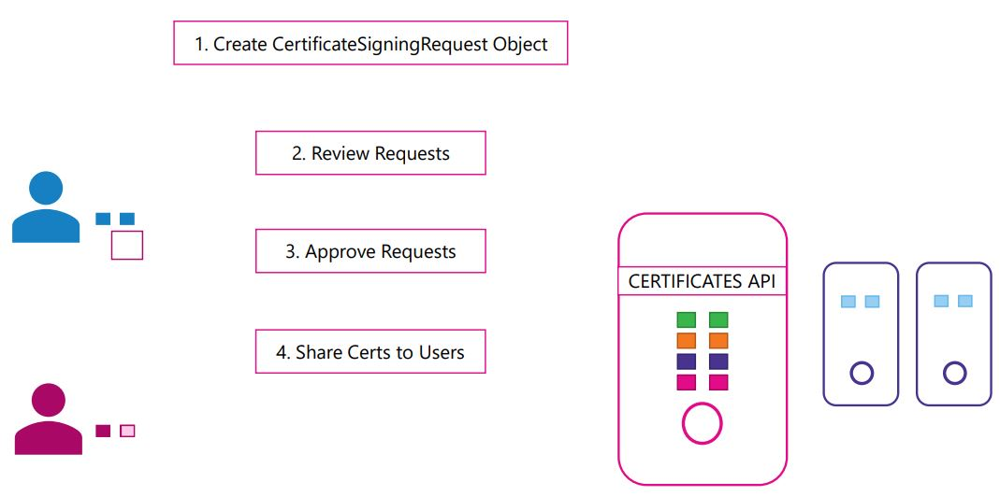

# K8S Security

Here's a clear and structured overview of the Kubernetes (K8s) security components, which help secure the cluster, nodes, workloads, and communication:

1. TLS Certificates - Everywhere
   1. SSL/TLS Basics
   2. Generate TLS certificates and configuration
2. Certificates API
3. Kubeconfig
4. API-Groups
5. RBAC
   1. Cluster Role & Role Bindings
6. Service Accounts
7. Image Security
8. Security Context
9. Network Policies
10. Custom Resource Definitions (CRD)
11. Workload Security
12. Third-party Tools & Enhancements

# 1. TLS Certificates - Everywhere:

TLS encrypts communication:
- API server ↔ kubelet
- API server ↔ etcd
- kube-proxy ↔ cluster
- External HTTPS (Ingress)

## 1. SSL/TLS Basics:

### **What is a Secure Sockets Layer (SSL)?**

Secure Sockets Layer (SSL) is a now deprecated cryptographic protocol that was designed to secure communication over the internet — primarily between web browsers and servers. It established a secure, encrypted connection to ensure data privacy and integrity.

#### **What SSL Does ?**

SSL encrypts:
- Web traffic (HTTPS)
- Emails (SMTP over SSL)
- VPN connections

SSL ensures:
* Confidentiality – data can't be read by third parties
* Integrity – data isn't tampered with in transit
* Authentication – server identity is verified via a certificate

#### Key Facts About SSL:

* Purpose:  Encrypt data in transit (e.g., login credentials, credit card info)
* Introduced: 1995 by Netscape
* Replaced by: TLS (Transport Layer Security)
* Status: SSL is obsolete and no longer secure

### What is Transport Layer Security (TLS)?

Transport Layer Security (TLS) is a cryptographic protocol that provides privacy, integrity, and authentication for data transmitted over a network — such as between a web browser and a web server (HTTPS), or within internal systems like Kubernetes components.

It is the modern, secure replacement for SSL (Secure Sockets Layer).

TLS Ensures:
- Confidentiality: Encrypts traffic (no eavesdropping)
- Integrity:       Detects tampering using HMAC or AEAD
- Authentication: Uses digital certificates (X.509) to verify identity

Understanding TLS vs SSL is important because these terms are often used interchangeably — but they’re not exactly the same.

### TLS vs SSL – Quick Comparison:

| Feature             | **SSL (Secure Sockets Layer)** | **TLS (Transport Layer Security)** |
| ------------------- | ------------------------------ | ---------------------------------- |
| 🔢 Latest Version   | SSL 3.0 (deprecated)           | TLS 1.3 (latest)                   |
| 📅 Release Timeline | 1995–1996 (SSL v2/v3)          | 1999–2018 (TLS 1.0 to 1.3)         |
| 🔒 Security         | Obsolete and vulnerable        | Actively maintained, secure        |
| ⚙️ Performance      | Slower and less efficient      | Faster handshake, better security  |
| 🔁 Used Today       | ❌ No                           | ✅ Yes (TLS 1.2 or 1.3)             |
| 🧩 Compatibility    | Older browsers/tools           | Modern browsers and systems        |

**Note:**

`🔸  When people say "SSL Certificate", they usually mean a TLS certificate — just old naming habit.`

### What Is a SSL/TLS Handshake?

The SSL/TLS handshake is the initial process that occurs when a client (like a web browser or kubectl) connects securely to a server (like a web server or Kubernetes API server).

It establishes a secure, encrypted communication channel by:
* Authenticating both parties (usually the server),
* Exchanging encryption keys,
* Agreeing on encryption methods.

Purpose of the TLS/SSL Handshake:
- Encryption:      Set up encryption for the session
- Authentication:  Verify the server’s identity using certificates
- Key Exchange:    Securely agree on a symmetric session key
- Integrity:       Ensure message integrity via MAC or AEAD

<p align="center">
  
</p>

**Core SSL/TLS Terminology:**

| Term                                                     | Description                                                                      |
| -------------------------------------------------------- | -------------------------------------------------------------------------------- |
| **SSL (Secure Sockets Layer)**                           | Older encryption protocol (deprecated)                                           |
| **TLS (Transport Layer Security)**                       | Modern, secure protocol that replaced SSL                                        |
| **Handshake**                                            | Initial process to establish a secure connection                                 |
| **Cipher Suite**                                         | A set of algorithms used during TLS (includes key exchange, encryption, MAC)     |
| **Symmetric Encryption**                                 | Encryption using the same key for encryption and decryption (e.g., AES)          |
| **Asymmetric Encryption**                                | Uses a **public/private key pair** (e.g., RSA, ECDSA)                            |
| **Session Key**                                          | A symmetric key generated during the handshake, used to encrypt the actual data  |
| **X.509 Certificate**                                    | Digital certificate used to prove the identity of the server/client              |
| **Public Key**                                           | Used to encrypt data or verify signatures                                        |
| **Private Key**                                          | Used to decrypt data or sign information                                         |
| **CA (Certificate Authority)**                           | A trusted organization that issues and signs certificates                        |
| **CSR (Certificate Signing Request)**                    | A request to a CA to issue a certificate, generated with a private key           |
| **Digital Signature**                                    | A cryptographic proof that verifies the authenticity of a certificate or message |
| **MAC (Message Authentication Code)**                    | Ensures data integrity and authenticity                                          |
| **AEAD (Authenticated Encryption with Associated Data)** | Encryption mode that combines encryption and integrity (e.g., AES-GCM)           |
| **Perfect Forward Secrecy (PFS)**                        | Ensures that session keys are not compromised even if the private key is         |
| **ECDHE (Elliptic Curve Diffie-Hellman Ephemeral)**      | A key exchange algorithm that supports forward secrecy                           |
| **TLS Record Protocol**                                  | Part of TLS that encrypts application data and ensures integrity                 |
| **TLS Alert Protocol**                                   | Notifies both ends about errors or session termination                           |
| **SNI (Server Name Indication)**                         | Allows multiple TLS certs on a single IP address (e.g., virtual hosting)         |
| **Root Certificate**                                     | A self-signed certificate at the top of the trust chain                          |
| **Intermediate Certificate**                             | Bridges between root and server certs; used in certificate chains                |
| **Certificate Chain**                                    | A chain of trust: server cert → intermediate → root CA                           |
| **TLS Versions**                                         | TLS 1.0, 1.1 (deprecated), 1.2 (widely used), 1.3 (latest)                       |


**Symmetric Encryption:**

Symmetric encryption encrypts and decrypts using the same (one) key. Compared to asymmetric cryptography, this is more efficient. 
It needs less encryption time, uses fewer resources, and can transfer large volumes of data, while also maintaining confidentiality. 
Cipher text is the same or smaller than the plain text.

Some of the examples of widely-used symmetric encryption include:
* Data Encryption Standard(DES),
* Triple Data Encryption Standard(3DES),
* Advanced Encryption Standard (AES), more.


**Asymmetric Encryption:**

Asymmetric encryption uses two keys: a public and a private key. This means a message encrypted with a public key can only be decrypted with the corresponding private key. It provides better security as the keys are never shared and allow the user to authenticate data using digital signatures. It is slower than symmetric encryption and can
only be utilized for small amounts of data. Cipher text is the same or larger than plain text.

Some of the examples of widely-used asymmetric encryption include:
* Rivest Shamir Adleman (RSA),
* Digital Signature Algorithm (DSA),
* the Diffie-Hellman exchange method, and more.

#### A Note on Key and Certificate Naming Conventions:

* Certificates that include a public key typically use the extensions .crt or .pem (for example, server.crt, server.pem, client.crt, or client.pem). 
* Private keys are usually indicated by the extension .key or may include the word “key” in the filename (e.g., server.key or server-key.pem). 
Adhering to these naming conventions helps distinguish between public certificates and private keys.

<p align="center">
  
</p>

<p align="center">
  
</p>

<p align="center">
  
</p>

#### The Role of Digital Certificates:

Digital certificates serve as more than just containers for public keys. They provide essential details including:
* Certificate owner's identity (subject)
* Issuer’s identity
* Validity dates
* Subject Alternative Names (SANs) for multiple domain support

### Generate TLS certificates for K8S:

#### Generating a Server Certificate:

1. Generate private key
```
openssl genrsa -out my-service.key 2048
```
2. Create a certificate signing request (CSR)
```
openssl req -new -key my-service.key -out my-service.csr -subj "/CN=my-service.my-namespace.svc"
```
3. Create a self-signed certificate (or send CSR to CA)
```
openssl x509 -req -in my-service.csr -signkey my-service.key -out my-service.crt -days 365
```
<p align="center">
  
</p>

<p align="center">
  
</p>

Note: 
1. We can have seperate CA for both kube-apiserver & etcd severs.

**Directory structure for manifests and certificates:**

K8S-Manifests:
```
controlplane ~ ➜  ls -l  /etc/kubernetes/manifests/
total 16
-rw------- 1 root root 2577 Jul  7 14:23 etcd.yaml
-rw------- 1 root root 3898 Jul  7 13:56 kube-apiserver.yaml
-rw------- 1 root root 3394 Jul  7 13:56 kube-controller-manager.yaml
-rw------- 1 root root 1656 Jul  7 13:56 kube-scheduler.yaml
```
K8S-Certificates:
```
controlplane ~ ➜  ls -l /etc/kubernetes/pki/
total 60
-rw-r--r-- 1 root root 1289 Jul  7 13:56 apiserver.crt
-rw-r--r-- 1 root root 1123 Jul  7 13:56 apiserver-etcd-client.crt
-rw------- 1 root root 1675 Jul  7 13:56 apiserver-etcd-client.key
-rw------- 1 root root 1679 Jul  7 13:56 apiserver.key
-rw-r--r-- 1 root root 1176 Jul  7 13:56 apiserver-kubelet-client.crt
-rw------- 1 root root 1675 Jul  7 13:56 apiserver-kubelet-client.key
-rw-r--r-- 1 root root 1107 Jul  7 13:56 ca.crt
-rw------- 1 root root 1675 Jul  7 13:56 ca.key
drwxr-xr-x 2 root root 4096 Jul  7 13:56 etcd
-rw-r--r-- 1 root root 1123 Jul  7 13:56 front-proxy-ca.crt
-rw------- 1 root root 1679 Jul  7 13:56 front-proxy-ca.key
-rw-r--r-- 1 root root 1119 Jul  7 13:56 front-proxy-client.crt
-rw------- 1 root root 1679 Jul  7 13:56 front-proxy-client.key
-rw------- 1 root root 1679 Jul  7 13:56 sa.key
-rw------- 1 root root  451 Jul  7 13:56 sa.pub

controlplane ~ ➜  ls -l /etc/kubernetes/pki/etcd/
total 32
-rw-r--r-- 1 root root 1094 Jul  7 13:56 ca.crt
-rw------- 1 root root 1679 Jul  7 13:56 ca.key
-rw-r--r-- 1 root root 1123 Jul  7 13:56 healthcheck-client.crt
-rw------- 1 root root 1679 Jul  7 13:56 healthcheck-client.key
-rw-r--r-- 1 root root 1208 Jul  7 13:56 peer.crt
-rw------- 1 root root 1679 Jul  7 13:56 peer.key
-rw-r--r-- 1 root root 1208 Jul  7 13:56 server.crt
-rw------- 1 root root 1679 Jul  7 13:56 server.key
```

<p align="center">
  
</p>

**Note:**
```
- If any authentication issues with kube-apiserver from kubectl or client or etcd
  - check the container logs for each service
    `docker ps -a|grep kube-apiserver`
    `docker ps -a|grep etcd'
    `docker logs <container_id>`
- Verify the certificate configuration and point the right certificate or path if mismatched.
```

**To verify the below certificate details like:**

- Certificate issuer common name
- Certificate Common_Name
- Expiry dates
- SAN -Subject Alternative Names
```
openssl x509 '/etc/kubernetes/pki/apiserver.crt' -text -noout
```
  
<p align="center">
  
</p>

# 2. Certificates API:

The Kubernetes Certificates API is a built-in API for managing TLS certificates inside the cluster. It allows you to:
- Request certificates (client or server)
- Approve or deny certificate requests
- Sign CSRs (Certificate Signing Requests)
- Fetch signed certificates

<p align="center">
  
</p>

**This API is commonly used to issue:**
- Client certificates (e.g., for users or kubelets)
- Certificates for internal workloads
- Automatically rotated kubelet certs (via kubelet client certificate rotation)

### 1. Generate Private Key and CSR
```
openssl genrsa -out user.key 2048
openssl req -new -key user.key -out user.csr -subj "/CN=my-user/O=dev-team"
```

### 2. Create a CertificateSigningRequest (CSR) Object
Base64 encode the CSR:
```
cat user.csr | base64 > base64_csr
```
Create a YAML file:
```
apiVersion: certificates.k8s.io/v1
kind: CertificateSigningRequest
metadata:
  name: my-user-csr
spec:
  request: <BASE64_CSR>
  signerName: kubernetes.io/kube-apiserver-client
  usages:
    - client auth
```
Then apply it:
```
kubectl apply -f csr.yaml
```

### 3. Approve the CSR
```
kubectl certificate approve my-user-csr
```

### 4. Get the Signed Certificate
```
kubectl get csr my-user-csr -o jsonpath='{.status.certificate}' | base64 --decode > user.crt
```

Now you have:
- user.crt: Signed certificate
- user.key: Private key
You can use this for secure client authentication (e.g., via kubectl).

### 5. What Is the Controller Manager's Role in CSR?

Here's how the Kubernetes Controller Manager is involved in CSR signing and automatic approval, especially for kubelet certificate bootstrapping and rotation.
The Kubernetes Controller Manager (kube-controller-manager) includes a certificate controller that:
- Watches for CertificateSigningRequest (CSR) resources
- Automatically approves or denies specific types of requests
- Signs the CSRs using a Kubernetes signer (like for kubelets)

#### Required Controller Manager Flags:

To enable automatic CSR signing and approval, these flags must be set on the kube-controller-manager:
```
--cluster-signing-cert-file=/etc/kubernetes/pki/ca.crt
--cluster-signing-key-file=/etc/kubernetes/pki/ca.key
--cluster-signing-duration=8760h
```
<p align="center">
  
</p>

#### Key Use Cases for Auto-Approval by Controller Manager

| Use Case                             | Signer Name                                   | Automatically Approved? |
| ------------------------------------ | --------------------------------------------- | ----------------------- |
| Kubelet TLS bootstrap                | `kubernetes.io/kube-apiserver-client-kubelet` | ✅ Yes (if configured)   |
| Kubelet serving certificate rotation | `kubernetes.io/kubelet-serving`               | ✅ Yes (if configured)   |

#### Enabling Auto-Approval (Kubelet Bootstrap)

Make sure:
- Kubelets start with bootstrap credentials (--bootstrap-kubeconfig)
- Controller Manager is running with required signer flags
- A ClusterRoleBinding exists to allow bootstrap tokens to create CSRs

```
kubectl create clusterrolebinding \
  kubelet-bootstrap \
  --clusterrole=system:node-bootstrapper \
  --group=system:bootstrappers
```

#### Kubelet CSR Workflow:

1. Initial Bootstrap Certificate

- Kubelet sends a CSR signed by its bootstrap token.
- CSR has signerName: kubernetes.io/kube-apiserver-client-kubelet
- Controller manager auto-approves and signs it if:
  - The group is system:bootstrappers
  - RBAC permits it

2. Certificate Rotation

- After a while (default: 1 year), kubelet renews the cert using:
  - signerName: kubernetes.io/kubelet-serving
- Controller manager can approve this too (if enabled)


