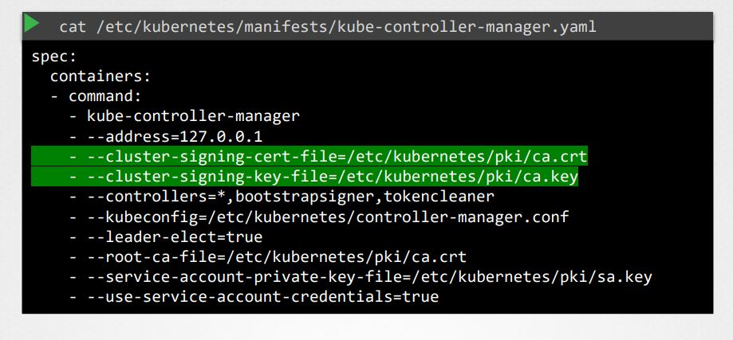
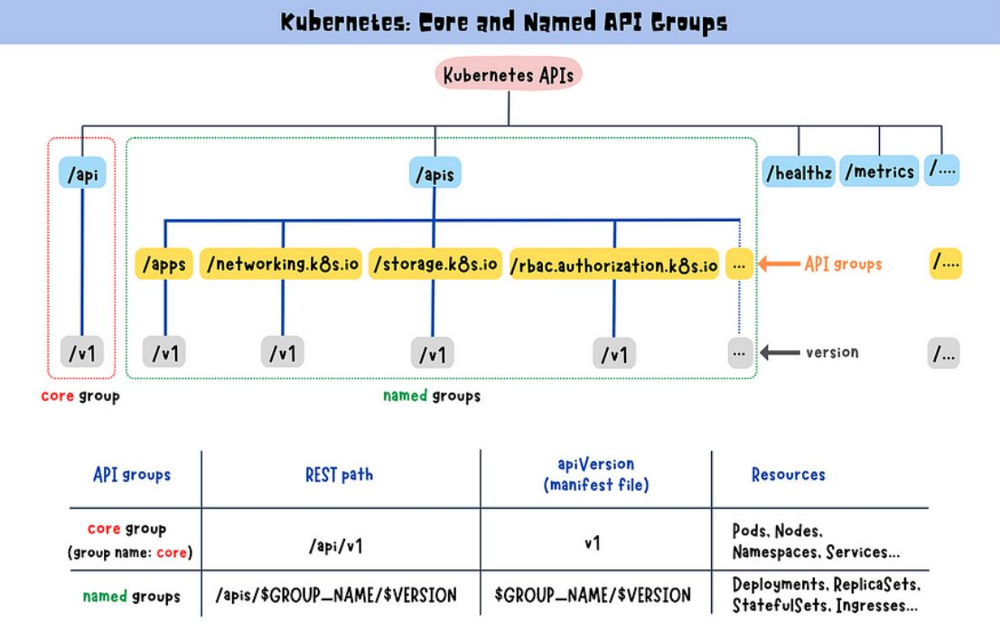
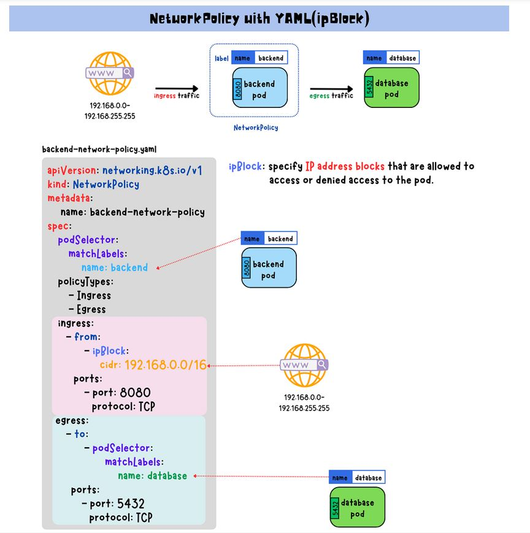

# K8S Security

Here's a clear and structured overview of the Kubernetes (K8s) security components, which help secure the cluster, nodes, workloads, and communication:

1. TLS Certificates - Everywhere
   1. SSL/TLS Basics
   2. Generate TLS certificates and configuration
2. K8S Certificates API 
3. Kubeconfig
4. API-Groups
5. Authorization
   1. Node Authorization
   2. ABAC Authorization
   3. RBAC
      - Role
      - Role-Binding
      - Cluster Role
      - Cluster Role-Binding
   4. Webhook
6. Image Security
7. Security Context
8. Network Policies

## 1. TLS Certificates - Everywhere:

TLS encrypts communication:
- API server ↔ kubelet
- API server ↔ etcd
- kube-proxy ↔ cluster
- External HTTPS (Ingress)

### 1. SSL/TLS Basics:

### **What is a Secure Sockets Layer (SSL)?**

Secure Sockets Layer (SSL) is a now deprecated cryptographic protocol that was designed to secure communication over the internet — primarily between web browsers and servers. It established a secure, encrypted connection to ensure data privacy and integrity.

#### **What SSL Does ?**

SSL encrypts:
- Web traffic (HTTPS)
- Emails (SMTP over SSL)
- VPN connections

SSL ensures:
* Confidentiality – data can't be read by third parties
* Integrity – data isn't tampered with in transit
* Authentication – server identity is verified via a certificate

#### Key Facts About SSL:

* Purpose:  Encrypt data in transit (e.g., login credentials, credit card info)
* Introduced: 1995 by Netscape
* Replaced by: TLS (Transport Layer Security)
* Status: SSL is obsolete and no longer secure

### What is Transport Layer Security (TLS)?

Transport Layer Security (TLS) is a cryptographic protocol that provides privacy, integrity, and authentication for data transmitted over a network — such as between a web browser and a web server (HTTPS), or within internal systems like Kubernetes components.

It is the modern, secure replacement for SSL (Secure Sockets Layer).

TLS Ensures:
- Confidentiality: Encrypts traffic (no eavesdropping)
- Integrity:       Detects tampering using HMAC or AEAD
- Authentication: Uses digital certificates (X.509) to verify identity

Understanding TLS vs SSL is important because these terms are often used interchangeably — but they’re not exactly the same.

### TLS vs SSL – Quick Comparison:

| Feature             | **SSL (Secure Sockets Layer)** | **TLS (Transport Layer Security)** |
| ------------------- | ------------------------------ | ---------------------------------- |
| 🔢 Latest Version   | SSL 3.0 (deprecated)           | TLS 1.3 (latest)                   |
| 📅 Release Timeline | 1995–1996 (SSL v2/v3)          | 1999–2018 (TLS 1.0 to 1.3)         |
| 🔒 Security         | Obsolete and vulnerable        | Actively maintained, secure        |
| ⚙️ Performance      | Slower and less efficient      | Faster handshake, better security  |
| 🔁 Used Today       | ❌ No                           | ✅ Yes (TLS 1.2 or 1.3)             |
| 🧩 Compatibility    | Older browsers/tools           | Modern browsers and systems        |

**Note:**

`🔸  When people say "SSL Certificate", they usually mean a TLS certificate — just old naming habit.`

### What Is a SSL/TLS Handshake?

The SSL/TLS handshake is the initial process that occurs when a client (like a web browser or kubectl) connects securely to a server (like a web server or Kubernetes API server).

It establishes a secure, encrypted communication channel by:
* Authenticating both parties (usually the server),
* Exchanging encryption keys,
* Agreeing on encryption methods.

Purpose of the TLS/SSL Handshake:
- Encryption:      Set up encryption for the session
- Authentication:  Verify the server’s identity using certificates
- Key Exchange:    Securely agree on a symmetric session key
- Integrity:       Ensure message integrity via MAC or AEAD

<p align="center">
  
</p>

**Core SSL/TLS Terminology:**

| Term                                                     | Description                                                                      |
| -------------------------------------------------------- | -------------------------------------------------------------------------------- |
| **SSL (Secure Sockets Layer)**                           | Older encryption protocol (deprecated)                                           |
| **TLS (Transport Layer Security)**                       | Modern, secure protocol that replaced SSL                                        |
| **Handshake**                                            | Initial process to establish a secure connection                                 |
| **Cipher Suite**                                         | A set of algorithms used during TLS (includes key exchange, encryption, MAC)     |
| **Symmetric Encryption**                                 | Encryption using the same key for encryption and decryption (e.g., AES)          |
| **Asymmetric Encryption**                                | Uses a **public/private key pair** (e.g., RSA, ECDSA)                            |
| **Session Key**                                          | A symmetric key generated during the handshake, used to encrypt the actual data  |
| **X.509 Certificate**                                    | Digital certificate used to prove the identity of the server/client              |
| **Public Key**                                           | Used to encrypt data or verify signatures                                        |
| **Private Key**                                          | Used to decrypt data or sign information                                         |
| **CA (Certificate Authority)**                           | A trusted organization that issues and signs certificates                        |
| **CSR (Certificate Signing Request)**                    | A request to a CA to issue a certificate, generated with a private key           |
| **Digital Signature**                                    | A cryptographic proof that verifies the authenticity of a certificate or message |
| **MAC (Message Authentication Code)**                    | Ensures data integrity and authenticity                                          |
| **AEAD (Authenticated Encryption with Associated Data)** | Encryption mode that combines encryption and integrity (e.g., AES-GCM)           |
| **Perfect Forward Secrecy (PFS)**                        | Ensures that session keys are not compromised even if the private key is         |
| **ECDHE (Elliptic Curve Diffie-Hellman Ephemeral)**      | A key exchange algorithm that supports forward secrecy                           |
| **TLS Record Protocol**                                  | Part of TLS that encrypts application data and ensures integrity                 |
| **TLS Alert Protocol**                                   | Notifies both ends about errors or session termination                           |
| **SNI (Server Name Indication)**                         | Allows multiple TLS certs on a single IP address (e.g., virtual hosting)         |
| **Root Certificate**                                     | A self-signed certificate at the top of the trust chain                          |
| **Intermediate Certificate**                             | Bridges between root and server certs; used in certificate chains                |
| **Certificate Chain**                                    | A chain of trust: server cert → intermediate → root CA                           |
| **TLS Versions**                                         | TLS 1.0, 1.1 (deprecated), 1.2 (widely used), 1.3 (latest)                       |


**Symmetric Encryption:**

Symmetric encryption encrypts and decrypts using the same (one) key. Compared to asymmetric cryptography, this is more efficient. 
It needs less encryption time, uses fewer resources, and can transfer large volumes of data, while also maintaining confidentiality. 
Cipher text is the same or smaller than the plain text.

Some of the examples of widely-used symmetric encryption include:
* Data Encryption Standard(DES),
* Triple Data Encryption Standard(3DES),
* Advanced Encryption Standard (AES), more.


**Asymmetric Encryption:**

Asymmetric encryption uses two keys: a public and a private key. This means a message encrypted with a public key can only be decrypted with the corresponding private key. It provides better security as the keys are never shared and allow the user to authenticate data using digital signatures. It is slower than symmetric encryption and can
only be utilized for small amounts of data. Cipher text is the same or larger than plain text.

Some of the examples of widely-used asymmetric encryption include:
* Rivest Shamir Adleman (RSA),
* Digital Signature Algorithm (DSA),
* the Diffie-Hellman exchange method, and more.

#### A Note on Key and Certificate Naming Conventions:

* Certificates that include a public key typically use the extensions .crt or .pem (for example, server.crt, server.pem, client.crt, or client.pem). 
* Private keys are usually indicated by the extension .key or may include the word “key” in the filename (e.g., server.key or server-key.pem). 
Adhering to these naming conventions helps distinguish between public certificates and private keys.

<p align="center">
  
</p>

<p align="center">
  
</p>

<p align="center">
  
</p>

#### The Role of Digital Certificates:

Digital certificates serve as more than just containers for public keys. They provide essential details including:
* Certificate owner's identity (subject)
* Issuer’s identity
* Validity dates
* Subject Alternative Names (SANs) for multiple domain support

### Generate TLS certificates for K8S:

#### Generating a Server Certificate:

1. Generate private key
```
openssl genrsa -out my-service.key 2048
```
2. Create a certificate signing request (CSR)
```
openssl req -new -key my-service.key -out my-service.csr -subj "/CN=my-service.my-namespace.svc"
```
3. Create a self-signed certificate (or send CSR to CA)
```
openssl x509 -req -in my-service.csr -signkey my-service.key -out my-service.crt -days 365
```
<p align="center">
  
</p>

<p align="center">
  
</p>

Note: 
1. We can have seperate CA for both kube-apiserver & etcd severs.

**Directory structure for manifests and certificates:**

K8S-Manifests:
```
controlplane ~ ➜  ls -l  /etc/kubernetes/manifests/
total 16
-rw------- 1 root root 2577 Jul  7 14:23 etcd.yaml
-rw------- 1 root root 3898 Jul  7 13:56 kube-apiserver.yaml
-rw------- 1 root root 3394 Jul  7 13:56 kube-controller-manager.yaml
-rw------- 1 root root 1656 Jul  7 13:56 kube-scheduler.yaml
```
K8S-Certificates:
```
controlplane ~ ➜  ls -l /etc/kubernetes/pki/
total 60
-rw-r--r-- 1 root root 1289 Jul  7 13:56 apiserver.crt
-rw-r--r-- 1 root root 1123 Jul  7 13:56 apiserver-etcd-client.crt
-rw------- 1 root root 1675 Jul  7 13:56 apiserver-etcd-client.key
-rw------- 1 root root 1679 Jul  7 13:56 apiserver.key
-rw-r--r-- 1 root root 1176 Jul  7 13:56 apiserver-kubelet-client.crt
-rw------- 1 root root 1675 Jul  7 13:56 apiserver-kubelet-client.key
-rw-r--r-- 1 root root 1107 Jul  7 13:56 ca.crt
-rw------- 1 root root 1675 Jul  7 13:56 ca.key
drwxr-xr-x 2 root root 4096 Jul  7 13:56 etcd
-rw-r--r-- 1 root root 1123 Jul  7 13:56 front-proxy-ca.crt
-rw------- 1 root root 1679 Jul  7 13:56 front-proxy-ca.key
-rw-r--r-- 1 root root 1119 Jul  7 13:56 front-proxy-client.crt
-rw------- 1 root root 1679 Jul  7 13:56 front-proxy-client.key
-rw------- 1 root root 1679 Jul  7 13:56 sa.key
-rw------- 1 root root  451 Jul  7 13:56 sa.pub

controlplane ~ ➜  ls -l /etc/kubernetes/pki/etcd/
total 32
-rw-r--r-- 1 root root 1094 Jul  7 13:56 ca.crt
-rw------- 1 root root 1679 Jul  7 13:56 ca.key
-rw-r--r-- 1 root root 1123 Jul  7 13:56 healthcheck-client.crt
-rw------- 1 root root 1679 Jul  7 13:56 healthcheck-client.key
-rw-r--r-- 1 root root 1208 Jul  7 13:56 peer.crt
-rw------- 1 root root 1679 Jul  7 13:56 peer.key
-rw-r--r-- 1 root root 1208 Jul  7 13:56 server.crt
-rw------- 1 root root 1679 Jul  7 13:56 server.key
```

<p align="center">
  
</p>

**Note:**
```
- If any authentication issues with kube-apiserver from kubectl or client or etcd
  - check the container logs for each service
    `docker ps -a|grep kube-apiserver`
    `docker ps -a|grep etcd'
    `docker logs <container_id>`
- Verify the certificate configuration and point the right certificate or path if mismatched.
```

**To verify the below certificate details like:**

- Certificate issuer common name
- Certificate Common_Name
- Expiry dates
- SAN -Subject Alternative Names
```
openssl x509 '/etc/kubernetes/pki/apiserver.crt' -text -noout
```
  
<p align="center">
  
</p>

## 2. K8S Certificates API:

The Kubernetes Certificates API is a built-in API for managing TLS certificates inside the cluster. It allows you to:
- Request certificates (client or server)
- Approve or deny certificate requests
- Sign CSRs (Certificate Signing Requests)
- Fetch signed certificates

<p align="center">
  
</p>

**This API is commonly used to issue:**
- Client certificates (e.g., for users or kubelets)
- Certificates for internal workloads
- Automatically rotated kubelet certs (via kubelet client certificate rotation)

### 1. Generate Private Key and CSR
```
openssl genrsa -out user.key 2048
openssl req -new -key user.key -out user.csr -subj "/CN=my-user/O=dev-team"
```

### 2. Create a CertificateSigningRequest (CSR) Object
Base64 encode the CSR:
```
cat user.csr | base64 > base64_csr
```
Create a YAML file:
```
apiVersion: certificates.k8s.io/v1
kind: CertificateSigningRequest
metadata:
  name: my-user-csr
spec:
  request: <BASE64_CSR>
  signerName: kubernetes.io/kube-apiserver-client
  usages:
    - client auth
```
Then apply it:
```
kubectl apply -f csr.yaml
```

### 3. Approve the CSR
```
kubectl certificate approve my-user-csr
```

### 4. Get the Signed Certificate
```
kubectl get csr my-user-csr -o jsonpath='{.status.certificate}' | base64 --decode > user.crt
```

Now you have:
- user.crt: Signed certificate
- user.key: Private key
You can use this for secure client authentication (e.g., via kubectl).

### 5. What Is the Controller Manager's Role in CSR?

Here's how the Kubernetes Controller Manager is involved in CSR signing and automatic approval, especially for kubelet certificate bootstrapping and rotation.
The Kubernetes Controller Manager (kube-controller-manager) includes a certificate controller that:
- Watches for CertificateSigningRequest (CSR) resources
- Automatically approves or denies specific types of requests
- Signs the CSRs using a Kubernetes signer (like for kubelets)

#### Required Controller Manager Flags:

To enable automatic CSR signing and approval, these flags must be set on the kube-controller-manager:
```
--cluster-signing-cert-file=/etc/kubernetes/pki/ca.crt
--cluster-signing-key-file=/etc/kubernetes/pki/ca.key
--cluster-signing-duration=8760h
```
<p align="center">
  
</p>

#### Key Use Cases for Auto-Approval by Controller Manager

| Use Case                             | Signer Name                                   | Automatically Approved? |
| ------------------------------------ | --------------------------------------------- | ----------------------- |
| Kubelet TLS bootstrap                | `kubernetes.io/kube-apiserver-client-kubelet` | ✅ Yes (if configured)   |
| Kubelet serving certificate rotation | `kubernetes.io/kubelet-serving`               | ✅ Yes (if configured)   |

#### Enabling Auto-Approval (Kubelet Bootstrap)

Make sure:
- Kubelets start with bootstrap credentials (--bootstrap-kubeconfig)
- Controller Manager is running with required signer flags
- A ClusterRoleBinding exists to allow bootstrap tokens to create CSRs

```
kubectl create clusterrolebinding \
  kubelet-bootstrap \
  --clusterrole=system:node-bootstrapper \
  --group=system:bootstrappers
```

#### Kubelet CSR Workflow:

1. Initial Bootstrap Certificate

- Kubelet sends a CSR signed by its bootstrap token.
- CSR has signerName: kubernetes.io/kube-apiserver-client-kubelet
- Controller manager auto-approves and signs it if:
  - The group is system:bootstrappers
  - RBAC permits it

2. Certificate Rotation

- After a while (default: 1 year), kubelet renews the cert using:
  - signerName: kubernetes.io/kubelet-serving
- Controller manager can approve this too (if enabled)

## 3. Kubeconfig:

**What is kubeconfig in Kubernetes?**

A kubeconfig file is a configuration file used by kubectl and other Kubernetes clients to connect to a Kubernetes cluster. It contains all the necessary details for authentication, authorization, and cluster endpoint access.

<p align="center">
  
</p>

**What’s Inside a kubeconfig?**

It’s a YAML file that defines:
| Section           | Description                                                        |
| ----------------- | ------------------------------------------------------------------ |
| `clusters`        | Information about Kubernetes API servers (name, endpoint, CA cert) |
| `users`           | Credentials for accessing the cluster (tokens, client certs, etc.) |
| `contexts`        | A named mapping of cluster + user combination                      |
| `current-context` | The default context (`kubectl` uses this one unless overridden)    |

<p align="center">
  
</p>

**Example kubeconfig File:**

```
apiVersion: v1
kind: Config
clusters:
- name: dev-cluster
  cluster:
    server: https://192.168.0.10:6443
    certificate-authority: /path/to/ca.crt

users:
- name: dev-user
  user:
    client-certificate: /path/to/dev-user.crt
    client-key: /path/to/dev-user.key

contexts:
- name: dev-context
  context:
    cluster: dev-cluster
    user: dev-user

current-context: dev-context
```

We can update kubeconfig specific to namespace as well:

<p align="center">
  
</p>

**How Does kubectl Use kubeconfig?**

When you run a kubectl command, it looks for the kubeconfig file in this order:
* --kubeconfig flag (if specified)
* $KUBECONFIG environment variable
* Default location: ~/.kube/config

**Common kubectl Commands with kubeconfig:**

<p align="center">
  
</p>

| Command                                 | Description            |
| ----------------------------------------|------------------------|
| `kubectl config current-context`        | View current context   |
| `kubectl config use-context dev-context`| Switch context         |
| `kubectl config get-contexts`           | View all contexts      |

## 4. API-Groups: (Authentication)

In Kubernetes, the API is organized into groups to version and structure different resources logically.

Each Kubernetes resource (like Pods, Deployments, ConfigMaps, etc.) belongs to a specific API group and version.

**Types of API Groups in Kubernetes:**

| Type              | Description                            | Example Resources                           |
| ----------------- | -------------------------------------- | ------------------------------------------- |
| **Core Group**    | No API group name (legacy group)       | `Pod`, `Service`, `ConfigMap`, `Secret`     |
| **Named Groups**  | Have a group name like `apps`, `batch` | `Deployment`, `Job`, `DaemonSet`, `Ingress` |
| **Custom Groups** | For Custom Resource Definitions (CRDs) | `MyResource.mygroup.io`                     |

<p align="center">
  
</p>

**Core Group:**

Yaml Template:
```
apiVersion: v1
kind: Pod
```

<p align="center">
  
</p>

**Named Group:**

Yaml Template:
```
apiVersion: apps/v1
kind: Deployment
```

<p align="center">
  
</p>

## 5. Authorization:

Once a user or service is authenticated, Kubernetes performs authorization to determine what actions they are allowed to perform.

📌 Think of it like:

- Authentication = Who are you?
- Authorization = what actions/operations allowed to you to perform

**How Authorization Works**

- User makes a request (e.g., kubectl get pods)
- Kubernetes authenticates the user (via certs, token, etc.)
- Authorization checks:
  - WHO is making the request?
  - WHAT resource and verb are requested? (e.g., get pods)
  - WHERE is the resource located? (namespace or cluster-wide)
If permitted, request proceeds; else, it's denied with 403 Forbidden.

**Built-in Authorization Modes:**

Kubernetes supports multiple authorization modes (enabled via the --authorization-mode flag on the API server). You can use one or combine multiple modes.

<p align="center">
  
</p>

| Mode          | Description                                      |
| ------------- | ------------------------------------------------ |
| `Node`        | Authorizes kubelets to access specific resources |
| `RBAC`        | Role-Based Access Control (**most common**) ✅    |
| `ABAC`        | Attribute-Based Access Control (deprecated)      |
| `Webhook`     | External service decides authorization           |
| `AlwaysAllow` | Allows all requests (⚠️ insecure)                |
| `AlwaysDeny`  | Denies all requests                              |

### Node Authorization:

```
In a Kubernetes cluster, each node runs a kubelet process that communicates with the Kubernetes API server
to manage pods and containers running on that node. The kubelet process is responsible for reporting the
status of the node and its containers, and for executing commands and pulling images from the container registry.
```

* Node Authorization is a specific type of authorization mode in Kubernetes that is used to authorize API requests made by kubelets. It is not intended for user authorization.
* To be authorized by the Node authorizer, a kubelet must use a credential that identifies it as a member of the system:nodes group and has a specific username format of system:node:<nodeName>.
* Therefore, when a kubelet makes an API request to the Kubernetes API server, it includes this TLS certificate as part of its credentials, along with the system:node:<nodeName> username and system:nodes group.
* The Node authorizer verifies these credentials to ensure that the kubelet is authorized to make the requested API call.

<p align="center">
  
</p>

### ABAC - Attribute Based Authorization Control:

Attribute-Based Access Control (ABAC) uses attributes to determine if a user or process has access to a resource. This policies consist of rules that match attributes in a user’s request with attributes in the policy.

<p align="center">
  
</p>

**Note:**
However, managing and updating ABAC policies can become complex, especially as the number of policies and attributes increase. This can lead to potential difficulties in maintaining the system over time.

### RBAC – Role-Based Access Control

RBAC (Role-Based Access Control) is the most common and flexible way to manage permissions in Kubernetes. It allows you to define who (users, groups, service accounts) can do what (verbs) on which resources.

RBAC uses roles and bindings to control access.

<p align="center">
  
</p>

**Key RBAC Resources:**
 
| Resource             | Scope        | Purpose                                                     |
| -------------------- | ------------ | ----------------------------------------------------------- |
| `Role`               | Namespaced   | Defines allowed actions in a namespace                      |
| `ClusterRole`        | Cluster-wide | Defines allowed actions across the cluster                  |
| `RoleBinding`        | Namespaced   | Grants Role to users/groups/service accounts in a namespace |
| `ClusterRoleBinding` | Cluster-wide | Grants ClusterRole access to users/groups/service accounts  |

**Common Verbs (Actions):**
```
verbs: ["get", "list", "watch", "create", "update", "patch", "delete"]
```
**Common Resources:**
```
resources: ["pods", "deployments", "services", "secrets", "configmaps"]
```

### K8S Resource Scope:

* Kubernetes resources can be classified as either namespaced or non-namespaced. 
* You can use the kubectl api-resources command to obtain a list of resources available in the Kubernetes API, along with their namespace scope. 
* To grant permissions to entities within a namespace, you can use Role. To grant permissions that span across the entire cluster, you can use ClusterRole. 
* After defining these roles, you can bind them to specific entities using RoleBinding for Role and ClusterRoleBinding for ClusterRole.

<p align="center">
  
</p>

Before setting up RBAC, it’s important to understand the Kubernetes user model. There are two ways to create “users” depending on the type of access that’s required:

**User vs ServiceAccount in Kubernetes:**

In Kubernetes, User and ServiceAccount are both subjects that can be granted permissions via RBAC. However, they serve different purposes and behave differently.

| Feature             | **User**                           | **ServiceAccount**                   |
| ------------------- | ---------------------------------- | ------------------------------------ |
| **Definition**      | External identity (human)          | Internal identity (for pods/tasks)   |
| **Created in K8s?** | ❌ No (not stored in K8s)           | ✅ Yes (API object)                   |
| **Usage**           | Used by humans (kubectl, CI/CD)    | Used by apps/pods inside the cluster |
| **Authentication**  | TLS client certs, tokens, OIDC     | Auto-mounted token in pod            |
| **Managed By**      | Admin or external IdP (e.g., OIDC) | Kubernetes                           |
| **RBAC Bindings**   | RoleBinding/ClusterRoleBinding     | RoleBinding/ClusterRoleBinding       |
| **Example Names**   | `john`, `devops@example.com`       | `system:serviceaccount:<ns>:<name>`  |

#### Verify step by step access with user/service account access to perform any operations on the cluster:

```
## Create a Service Account
## You need to create a Service Account to use in the next steps. You’ll bind the Role you create to this Service Account:
kubectl create serviceaccount demo-user

## Next, run the following command to create an authorization token for your Service Account:
## The token’s value will now be saved to the $TOKEN environment variable in your terminal.
TOKEN=$(kubectl create token demo-user)

## Configure kubectl with your Service Account
kubectl config set-credentials demo-user --token=$TOKEN

## Next, add your new context—we’re calling it demo-user-context. Reference your new demo-user credential and your current Kubernetes cluster. (We’re using the default cluster, but you should change this value if you’re connected to a differently named cluster.)

kubectl config set-context demo-user-context --cluster=default --user=demo-user

## Before switching to your new context, first check the name of your current context
kubectl config current-context
kubectl config use-context demo-user-context

## Try to list the Pods in the namespace:
$ kubectl get pods
Error from server (Forbidden): pods is forbidden: User "system:serviceaccount:default:demo-user" cannot list resource "pods" in API group "" in the namespace "default"

A Forbidden error is returned because your Service Account hasn’t been assigned any RBAC roles that include the get pods permission.
```
#### Basic yaml template for Role:
```
apiVersion: rbac.authorization.k8s.io/v1
kind: Role
metadata:
  name: pod-reader
  namespace: dev        # Role is restricted to the 'dev' namespace
rules:
- apiGroups: [""]
  resources: ["pods"]
  verbs: ["get", "list", "watch"]
```

`kubectl apply -f role.yaml`

#### Basic yaml template for Role-Binding:
```
apiVersion: rbac.authorization.k8s.io/v1
kind: RoleBinding
metadata:
  name: <rolebinding-name>          # e.g., read-pods
  namespace: <namespace-name>       # e.g., dev
subjects:
- kind: <User|Group|ServiceAccount> # Choose one: User / Group / ServiceAccount
  name: <subject-name>              # e.g., alice or default
  namespace: <subject-namespace>    # Only for ServiceAccounts
  apiGroup: rbac.authorization.k8s.io
roleRef:
  kind: Role                        # Must match the bound role type (Role or ClusterRole)
  name: <role-name>                 # e.g., pod-reader
  apiGroup: rbac.authorization.k8s.io
```
<p align="center">
  
</p>

`kubectl apply -f role-binding.yaml`

####  Basic yaml template for Cluster Role:
```
apiVersion: rbac.authorization.k8s.io/v1
kind: ClusterRole
metadata:
  name: read-all-pods
rules:
- apiGroups: [""]
  resources: ["pods"]
  verbs: ["get", "list", "watch"]
```
`kubectl apply -f cluster-role.yaml`

####  Basic yaml template for Cluster Role-Binding:
```
apiVersion: rbac.authorization.k8s.io/v1
kind: ClusterRoleBinding
metadata:
  name: bind-read-all-pods
subjects:
- kind: User                      # or ServiceAccount / Group
  name: alice                     # username or service account name
  namespace: dev                  # only for ServiceAccounts
  apiGroup: rbac.authorization.k8s.io
roleRef:
  kind: ClusterRole
  name: read-all-pods
  apiGroup: rbac.authorization.k8s.io
```
`kubectl apply -f cluster-rolebinding.yaml`

<p align="center">
  
</p>

### Webhook Authrization:

Webhook authorization mode allows for custom authorization logic by delegating the authorization decision to an external HTTP service, known as a webhook.

* When a user or process sends a request to the Kubernetes API server, the server sends a webhook authorization request to the external authorizer. 
* The authorizer evaluates the request against the defined policies and sends a callback response indicating whether the request is authorized or not.
* This enables Kubernetes administrators to implement complex and customized authorization rules specific to their organization’s needs using any external system for making authorization decisions, such as an LDAP or Active Directory server, a database, or custom code.

<p align="center">
  
</p>

**Important Kubectl commands with role & rolebinding:**
```
kubectl api-resources                             # The kubectl api-resources command provides information about resources available in the Kubernetes API,
                                                  # including whether they are namespaced or not.

kubectl api-versions | grep rbac                  # Check whether RBAC is enabled
kube-apiserver --authorization-mode=RBAC          # To manually enable RBAC support
kubectl get roles                                 # list the roles
kubectl get rolebindings                          # list the rolebindigs
kubectl describe role <role-name>                 # to check details of role
kubectl dcesribe rolebinding <role-binding-name>  # to check the details pf role-binding
kubectl auth can-i create deployments -n default  # To check whether user has permission to create deployment
kubectl auth can-i delete nodes                   # To check whether use has permisson to delete nodes
```
### Configure Authorization Modes:

1. Edit the kube-apiserver.yaml configuration file located at /etc/kubernetes/manifests/kube-apiserver.yaml
2. Add the desired authorization mode to the --authorization-mode flag, separating multiple modes with commas.

**How Multi Authorization mode works with the Flag:**

<p align="center">
  
</p>

**Request Flow Example:**

1. A request (e.g., kubectl delete pod) is received.
2. Kubernetes tries:
   - Node mode → if it's a node-initiated action (e.g., kubelet logs a pod) → allow/deny.
   - If not allowed, then tries:
   - RBAC → does the subject have a matching Role/ClusterRole? → allow/deny.
   - If not allowed, then tries:
   - Webhook → sends request data to external webhook → allow/deny.
3. If none say "allow" → ❌ request is denied.

**Note:**

* Multiple Authorization Modes allows cluster administrators to use more than one authorization mode to secure access to Kubernetes resources. 
* When a user makes a request to the Kubernetes API server, each authorization mode is evaluated in order until one of them successfully authorizes or denies the request. If all modes fail, the request is denied.

## 6. Image Security:

Securing container images in Kubernetes is critical to prevent vulnerabilities, malware, and supply chain attacks from being introduced into your clusters.

<p align="center">
  
</p>

### Kubernetes Image Security Best Practices:

1. Use Trusted Base Images
   - Start with official or verified base images (e.g., from Docker Hub, distroless, Alpine).
   - Avoid using latest tag; use pinned versions like nginx:1.21.1.

2. Scan Images for Vulnerabilities
   - Use image scanning tools to detect known vulnerabilities:
   
3. Enforce Image Policies (Admission Controls)/ Use tools to restrict which images can run:
   - Kubernetes-native options: OPA/Gatekeeper: Define policies like:
   
4. Enable Image Signing & Verification
   
5. Use Private/Authenticated Image Registries
   - Store sensitive or internal images in private registries.
   - Configure imagePullSecrets in Kubernetes to securely access them
   ```
   imagePullSecrets:
   - name: regcred
   ```
   
6. Limit Pod Permissions
   - Run containers as non-root wherever possible.
   - Use PodSecurityPolicies (deprecated) or Pod Security Admission:
     - Enforce that images run with least privilege.
     ```
     securityContext:
       runAsNonRoot: true
       allowPrivilegeEscalation: false
     ```
     
7. Block Dangerous Images: Use a validating webhook or Kyverno/OPA to block:
   - Images from unknown registries
   - Images using latest
   - Unscanned or unsigned images

### Create an image pull secret to apply on deployment configuration:
```
kubectl create secret docker-registry private-reg-cred \
  --docker-server=myprivateregistry.com:5000 \
  --docker-username=dock_user \
  --docker-password=dock_password \
  --docker-email=dock_user@myprivateregistry.com
```

### Apply the configuration in deployment:

`kubectl edir deployment <deployment-name>`

```
spec:
  replicas: 2
  selector:
    matchLabels:
      app: web
  template:
    metadata:
      creationTimestamp: null
      labels:
        app: web
    spec:
      containers:
      - image: myprivateregistry.com:5000/nginx:alpine
        imagePullPolicy: IfNotPresent
        name: nginx
      imagePullSecrets:
      - name: private-reg-cred

```

## 7. Security Context:

* Kubernetes security contexts define runtime security settings for pods or containers. 
* If no security context is specified, Kubernetes applies a default one, which may not meet requirements. 
* You can add securityContext field in the pod manifest file to set up security contexts at the pod or container level. 
* Pod-level settings inherited by all containers and container-level settings only applying to that container. 
* Container-level settings always override pod-level settings. 
* The capabilities field adds specific capabilities to a container’s security context at the container level, not possible at the pod level.

<p align="center">
  
</p>

### Specify Security Context at the Pod Level:

In this example, the securityContext field has been defined at the Pod level with the runAsUser and fsGroup properties set to 1000 and 2000 respectively. Therefore, both containers will run as the user with UID 1000 and have access to the group with GID 2000.

<p align="center">
  
</p>

Yaml example:
```
apiVersion: v1
kind: Pod
metadata:
  name: mypod
spec:
  securityContext:
    runAsUser: 1000
    fsGroup: 2000
  containers:
  - name: container1
    image: nginx
  - name: container2
    image: busybox
```

### Specify Security Context at the Container Level:

securityContext specified at the container level only apply to the individual container, not to other containers in the pod.

In this example, each container in the pod has its own security context specified with the securityContext field. The runAsUser field is specified with a different value for each container. container1 runs with user ID 1000, while container2 runs with user ID 2000, and there is no inheritance or sharing of the security context between the two containers.

<p align="center">
  
</p>

pod.yaml
```
apiVersion: v1
kind: Pod
metadata:
  name: mypod
spec:
  containers:
  - name: container1
    image: nginx
    securityContext:
      runAsUser: 1000
  - name: container2
    image: busybox
    securityContext:
      runAsUser: 2000
```

### Specify Security Context at the Pod and Container Level:

securityContext sets at the container level always override those set at the pod level.

In this example, the pod-level securityContext sets the runAsUser value to 1000, while the container-level securityContext sets the runAsUser value to 2000, which overrides the pod-level security context. This means that the container will run with the user ID of 2000, regardless of the pod-level setting.

<p align="center">
  
</p>

pod.yaml
```
apiVersion: v1
kind: Pod
metadata:
  name: mypod
spec:
  securityContext:
    runAsUser: 1000
  containers:
  - name: my-container
    image: my-image
    securityContext:
      runAsUser: 2000
```
## 8. Network Policies:

NetworkPolicy is a Kubernetes object that enables the creation of policies to restrict the communication between pods and external entities in a namespace, using various factors like IP addresses, ports, protocols, and labels. 

* The ingress section defines incoming traffic rules while the egress section defines outgoing traffic rules.
* NetworkPolicy uses podSelector to select pods based on their labels, namespaceSelector to select pods in particular namespaces, and ipBlock to specify IP address blocks allowed or denied access to pods.

### Ingress and Egress Traffic:

<p align="center">
  
</p>

**Ingress traffic** refers to the incoming network traffic that is directed to a pod or a group of pods in the Kubernetes cluster. For example, if a user outside the cluster sends a request to a pod within the cluster, the traffic would be considered ingress traffic to that pod.

**Egress traffic**, on the other hand, refers to the outgoing network traffic from a pod or a group of pods in the Kubernetes cluster. For example, if a pod in the cluster sends a request to a service or an external endpoint outside the cluster, the traffic would be considered egress traffic from that pod.

**Note:**

* By default, Kubernetes clusters allow unrestricted communication between pods and external access, which can pose security risks, especially in multi-tenant environments where multiple applications and teams coexist.
* It's like a firewall for pods — by default, all traffic is allowed, but once a policy is applied, traffic is denied unless explicitly allowed.

```
$ kubectl api-resources|grep networkpolicies
NAME             SHORTNAMES   APIVERSION            NAMESPACED  KIND
networkpolicies  netpol       networking.k8s.io/v1  true        NetworkPolicy
```

### NetworkPolicy with podSelector:

The podSelector field selects pods based on their labels and determines which pods the policy applies to.

<p align="center">
  
</p>

In this case, this NetworkPolicy targets pods labeled with name: backend. The ingress section defines incoming traffic rules from name: frontend pods on port 8080. The egress section defines outgoing traffic rules to name: database pods on port 5432.

### NetworkPolicy with namespaceSelector:

namespaceSelector is a field that allows you to select particular namespaces and apply network policy rules to all the pods within those namespaces.

<p align="center">
  
</p>

<p align="center">
  
</p>

In this case, it allows traffic from the pods in namespace1.

### NetworkPolicy with ipBlock:

ipBlock is a field used to specify IP address blocks that are allowed to access or denied access to the pod. It can be used to define a CIDR block or a single IP address.

<p align="center">
  
</p>

In this example, the ipBlock field is used to specify the CIDR block 192.168.0.0/16. The ingress section allows incoming traffic to the pod on port 8080 using the TCP protocol only if the source IP address is within this CIDR block.


