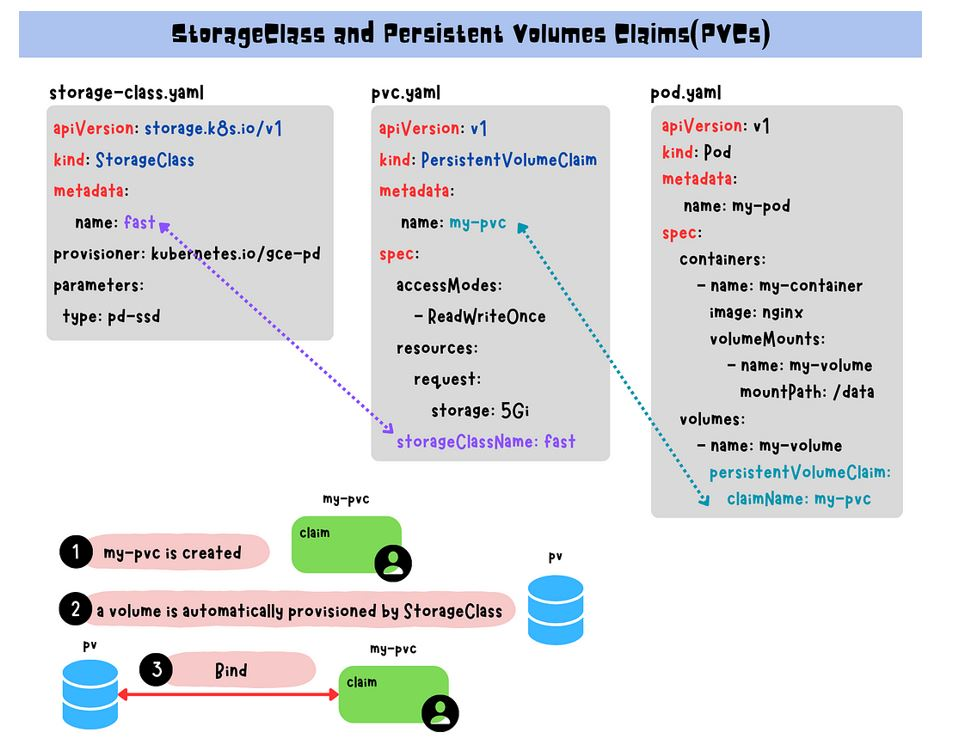

# K8S - Storage:

In Kubernetes, pods are temporary and any data stored within them is lost when they’re deleted or restarted. 

To avoid this, use persistent storage options such as PVs(Persistent Volumes)and PVCs(Persistent Volume Claims). 

* PVs are storage resources with an independent lifecycle, while PVCs are requests for storage.
* Use them for simplified storage management and scaling. Provisioning persistent volumes can be static or dynamic.
* StorageClass defines the provisioner, parameters, and reclaim policy for dynamically provisioned PVs.

## Core Storage Concepts in Kubernetes:

| Resource                      | Purpose                                              |
|:----------------------------- |:---------------------------------------------------- |
| `Volume`                      | Basic unit of storage attached to a pod              |
| `PersistentVolume (PV)`       | Cluster-wide static storage resource                 |
| `PersistentVolumeClaim (PVC)` | Request for storage by a pod                         |
| `StorageClass`                | Defines dynamic provisioning rules (like size, type) |
| `VolumeMount`                 | Mounts the volume inside the container               |

In Kubernetes, Pods are the smallest deployable unit that can contain one or more containers, each with their own storage requirements. However, because Pods are ephemeral, any data stored within a Pod is lost when the Pod is deleted or restarted. To avoid such data loss, it is important to use persistent storage options that allow data to be stored outside of a Pod, persisting beyond the lifetime of a Pod.

**Volumes and Mount**

In Kubernetes, a volume is a directory that is accessible to containers in a pod. Volumes provide a way for containers to store and access data, and they can be used to share data between containers in the same pod.

**Manifest file**

To use a volume in a Pod, you need to specify the volume in the Pod’s YAML file using the spec.volumes field and then mount it to a directory within the container's file system using the spec.containers[*].volumeMounts field.

<p align="center">
  
</p>

pod.yaml
```
apiVersion: v1
kind: Pod
metadata:
  name: myapp
spec:
  containers:
    - name: myapp-container
      image: myapp-image
      volumeMounts:
        - name: data-volume
          mountPath: /data
  volumes:
    - name: data-volume
      hostPath:
        path: /mnt/data
```

In this example, the spec.volumes field is used to define a hostPath volume named data-volume. The hostPath field specifies the directory on the host where the data will be stored. The spec.containers[*].volumeMounts field is then used to mount the data-volume volume to a directory within the container's file system. In this case, the data-volume volume is mounted to the /data directory within the container.

This configuration allows the container to write data to the /mnt/data directory on the host, which will be persisted even if the Pod is deleted or restarted.

**Drawbacks:**

<p align="center">
  
</p>

Volumes can add complexity to applications because they require separate management of storage requirements for each Pod. Updating storage requirements for a Pod requires modifying the pod definition file and redeploying, which can be time-consuming and error-prone.

## PV's and PVC'S:

A **Persistent Volume** (PV) in Kubernetes is a storage resource provisioned in the cluster. It has an independent lifecycle from the Pod that use it, allowing data to persist even if the Pod is deleted. PVs can be physical disks or cloud-based storage resources like Amazon EBS volumes.

A **Persistent Volume Claim** (PVC) is a request for storage by a user. Users can make PVC requests without having to know the details of where the storage is coming from. The Kubernetes control plane then finds an available PV that meets the claim’s requirements and binds the claim to the PV. The relationship between PV and PVC in Kubernetes is one-to-one. Once a PVC is bound to a PV, no other PVC can bind to that same PV.

<p align="center">
  
</p>

By using PVs and PVCs, storage management and scaling in Kubernetes are simplified. Admins can manage PVs independently of Pods, enabling them to provision, resize, and delete storage resources without impacting the Pods. Meanwhile, PVCs let users request specific storage amounts without requiring knowledge of the underlying storage system.

**Manifest file:**

<p align="center">
  
</p>

pv.yaml
```
apiVersion: v1
kind: PersistentVolume
metadata:
  name: my-pv
spec:
  capacity:
    storage: 5Gi
  accessModes:
    - ReadWriteOnce
  persistentVolumeReclaimPolicy: Retain
  hostPath:
    path: /mnt/data
```

**Access Modes:**

| Mode            | Description                                         |
| --------------- | --------------------------------------------------- |
| `ReadWriteOnce` | Mounted as read-write by **one node**               |
| `ReadOnlyMany`  | Mounted as read-only by **many nodes**              |
| `ReadWriteMany` | Mounted as read-write by **many nodes** (e.g., NFS) |

**Reclaim Policy Options:**

| Value     | Behavior                                                               |
| --------- | ---------------------------------------------------------------------- |
| `Retain`  | The PV and its data are **retained**. Manual cleanup or reuse needed.  |
| `Delete`  | The PV and the underlying **storage asset are deleted** automatically. |
| `Recycle` | ⚠️ **Deprecated**: The volume is scrubbed and made available again.    |

pvc.yaml:
```
apiVersion: v1
kind: PersistentVolumeClaim
metadata:
  name: my-pvc
spec:
  accessModes:
    - ReadWriteOnce
  resources:
    requests:
      storage: 5Gi
```

pod.yaml:
```
apiVersion: v1
kind: Pod
metadata:
  name: my-pod
spec:
  containers:
    - name: my-container
      image: nginx
      volumeMounts:
        - name: my-volume
          mountPath: /data
  volumes:
    - name: my-volume
      persistentVolumeClaim:
        claimName: my-pvc
```

* The Pod has one volume named my-volume, which is created using a PVC named my-pvc. 
* The PVC specifies the claimName field to request storage from a Persistent Volume (PV) that matches the storage requirements.
* The volume is then mounted to the container’s file system using the volumeMounts field. The volumeMounts field specifies that the my-volume volume should be mounted at the directory /data within the container.

**Provision Persistent Volumes:**

In Kubernetes, there are two ways to provision volumes: static and dynamic.

**Static Provisioning**

Static provisioning involves the cluster administrator creating a set of Persistent Volumes (PVs) with predefined storage types for use by developers. It is ideal for organizations with predictable storage needs or shared storage across multiple teams or applications.

**Static Provisioning Flow:**

1. Admin creates a PersistentVolume (PV), pointing to a real storage backend (e.g., NFS, hostPath).
2. User creates a PersistentVolumeClaim (PVC) requesting a volume.
3. Kubernetes binds the PVC to a matching PV based on:
   - Size
   - AccessModes
   - StorageClass (optional)
4. The pod uses the PVC via volumeMount.

**Dynamic Provisioning**

Dynamic provisioning automatically provisions storage when a Persistent Volume Claim (PVC) is created using a StorageClass that defines the required storage type. This method eliminates the need for administrators to manage PVs manually and is suitable for organizations with unpredictable storage needs or requiring more flexibility in their storage options.

**Storage Classes**

In Kubernetes, a StorageClass is an object that defines the provisioner, parameters, and reclaim policy for dynamically provisioned Persistent Volumes (PVs). A StorageClass provides a way for administrators to define storage profiles with different performance characteristics or backend storage providers.

StorageClasses enable dynamic provisioning of storage volumes, meaning that when a user creates a Persistent Volume Claim (PVC), a volume is automatically provisioned for them based on the StorageClass’s parameters. It simplifies storage management and provides greater flexibility and efficiency in managing storage resources in Kubernetes.

**Manifest file:**

<p align="center">
  
</p>

storage-class.yaml:
```
apiVersion: storage.k8s.io/v1
kind: StorageClass
metadata:
  name: fast
provisioner: kubernetes.io/gce-pd
parameters:
  type: pd-ssd
```

Define a provisioner and storage parameters to create the PV on-demand when a PVC is requested.

**pvc.yaml**:
```
apiVersion: v1
kind: PersistentVolu
meClaim
metadata:
  name: my-pvc
spec:
  accessModes:
    - ReadWriteOnce
  resources:
    requests:
      storage: 5Gi
  storageClassName: fast
```

Request a PVC with a specific storage size and accessModes, and specifies the storageClassName that matches the StorageClass name in storage-class.yaml.

**pod.yaml:**
```
apiVersion: v1
kind: Pod
metadata:
  name: my-pod
spec:
  containers:
    - name: my-container
      image: nginx
      volumeMounts:
        - name: my-volume
          mountPath: /data
  volumes:
    - name: my-volume
      persistentVolumeClaim:
        claimName: my-pvc
```
**Short Name:**

```
$ kubectl api-resources
NAME                   SHORTNAMES APIVERSION        NAMESPACED KIND
persistentvolumeclaims pvc        v1                true       PersistentVolumeClaim
persistentvolumes      pv         v1                false      PersistentVolume
storageclasses         sc         storage.k8s.io/v1 false      StorageClass
```


